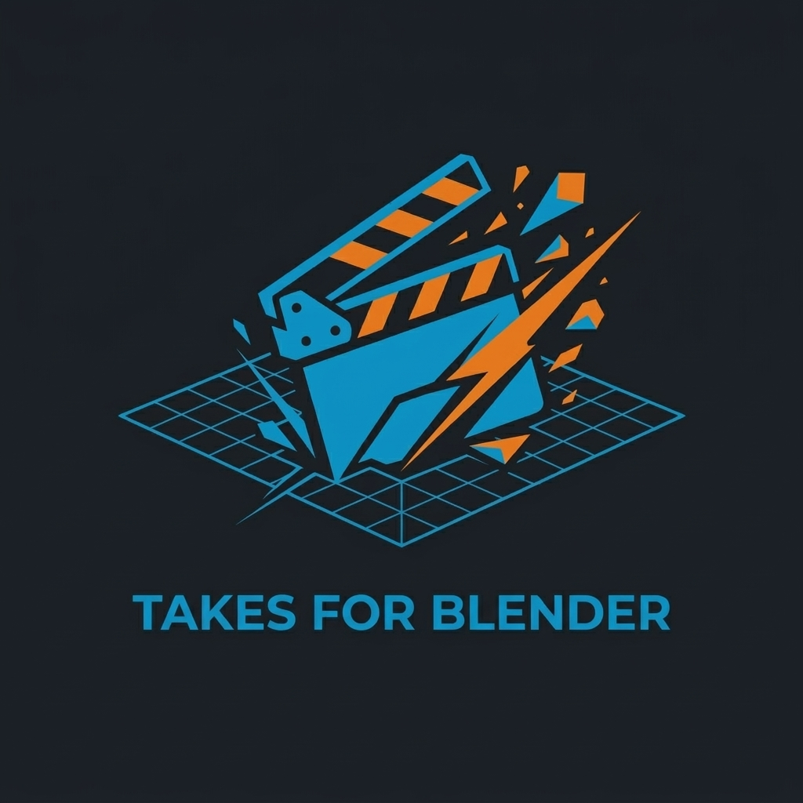
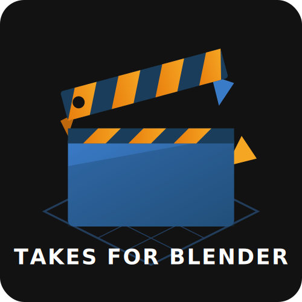

# Takes for Blender – Corporate Identity (CI)

Dieses Dokument legt die grundlegenden **Markenrichtlinien** und die **Corporate Identity** fest, die sich aus dem Premium-Web-UI-Mockup ableiten. Es definiert die Regeln für Farben, Typografie und UI-Sprache, um die Konsistenz im Add-on, in der Dokumentation und in allen Marketingmaterialien sicherzustellen.

---

## 01. Markenphilosophie
**"Professionell, nativ und leistungsstark."**
Takes for Blender ist eine robuste Pipeline für das Stage-Management. Die visuelle Identität muss Stabilität, höchste technische Kompetenz und eine nahtlose native Integration in die eigene Designsprache von Blender vermitteln. Es sollte sich wie ein hochwertiges, direkt vom Hersteller stammendes Engine-Upgrade anfühlen.

---

## 02. Farbpalette
Die Marke verwendet ausschließlich die ikonischen Blender-Farben, die tief gesättigt sind und einen starken Kontrast zum modernen Dark-Mode-Hintergrund bilden.

### Kernfarben der Marke
| Farbe | Hex-Code | Verwendung |
| :--- | :--- | :--- |
| **Blender-Orange** | `#e87d0d` | Primäre Handlungsaufforderungen, aktive Zustände, Hervorhebungen. |
| **Leuchtendes Orange** | `#f5a623` | Gradientenhöhenpunkte, leuchtende Hover-Effekte. |
| **Blender Blue** | `#265787` | Strukturelemente, sekundäre Schaltflächen, aktive Registerkarten. |
| **Bright Blue** | `#3a7bc8` | Textverläufe, Linkfarben. |

### Hintergründe & Oberflächen
| Oberfläche | Hex-Code | Verwendung |
| :--- | :--- | :--- |
| **Deep Base** | `#0a0a0c` | Absoluter Hintergrund von Webseiten (leer). |
| **Surface Dark** | `#121215` | Standard-Seitenhintergrund und Panel-Grundlagen. |
| **Oberfläche Float** | `#1e1e24` | Erhabene Karten, Dropdown-Menüs, verschachtelte Panels. |
| **Rahmen** | `rgba(255,255,255, 0.05)` | Extrem dezente Striche auf Karten zur Definition von Kanten. |

---

## 03. Typografie
Die Identität basiert auf einer kontrastreichen Kombination aus einer geometrischen Display-Schrift und einer gut lesbaren Leseschrift.

* **Primäre Überschriften (Display):** [**Outfit**](https://fonts.google.com/specimen/Outfit)
  * Verwendung für große Hero-Bereiche, `h1` - `h3`-Tags und Logotext.
  * Schriftstärken: `600 (SemiBold)`, `800 (ExtraBold)`.
  * *Warum:* Die subtile Geometrie vermittelt einen modernen "3D-Software"-Charakter.
* **Fließtext (Benutzeroberfläche/Lesetext):** [**Inter**](https://fonts.google.com/specimen/Inter)
  * Verwendung für alle Absätze, Navigationslinks und UI-Beschriftungen.
  * Schriftstärken: `400 (Regular)`, `500 (Medium)`.
  * *Warum:* Optimale Lesbarkeit bei kleinen UI-Größen.
* **Code & Technik:** [**JetBrains Mono**](https://fonts.google.com/specimen/JetBrains+Mono)
  * Verwendung für die Darstellung von Code-Schnipseln, Python-API-Dokumentationen und Befehlszeilentext.

---

## 04. UI-Elemente & visuelle Sprache

### Glassmorphism (Die zentrale Ästhetik)
Überschriften, schwebende Menüs und hervorgehobene Karten müssen einen dunklen, mattierten Glaseffekt aufweisen.
* **Hintergrund:** `rgba(38, 87, 135, 0.2)` (Dunkelblau getönt)
* **Unschärfe:** `backdrop-filter: blur(16px)`
* **Rand:** 1px obere Umrandung `rgba(255, 255, 255, 0.08)`, um das "Licht" einzufangen.

### Der Farbverlauf-Texteffekt
Große Überschriften (wie "Takes for Blender") nutzen einen horizontalen Farbverlaufsblock, um den Blick sofort auf sich zu ziehen.
* `linear-gradient(90deg, #3a7bc8 0%, #f5a623 100%)`

### Formgeometrie & Rahmen
* **Rahmenradiografie:** 
  * `8px` für große Rasterkarten und Container.
  * `6px` für Hauptschaltflächen.
  * `4px` für interne Pillen/Tags.
* **Hover-Zustände von Karten:** 
  * Niemals strecken oder verzerren. Stattdessen nach oben schweben lassen `translateY(-4px)`.
  * Einen weichen, farbigen Schlagschatten einfügen, der der Marke entspricht (z. B. `0 10px 25px rgba(232, 125, 13, 0.15)`).

---

## 05. Bildsprache & Ikonografie

Das offizielle "Takes for Blender"-Logo kombiniert die ikonische 3D-Filmklappe mit der strengen Originalfarbgebung von Blender und betont dabei die isometrische Struktur gegenüber komplexen Farbverläufen.

### Das Hauptlogo (Flat Render)
Bei Nicht-SVG-Kontexten oder komplexen Hintergründen wird die einfarbige, flache Vektordarstellung verwendet.

### Das strukturelle Logo (SVG)
Die strukturelle Kerngeometrie des Logos verwendet unverfälschte mathematische XML-Koordinaten und reine Blender-Hex-Farbtöne.

