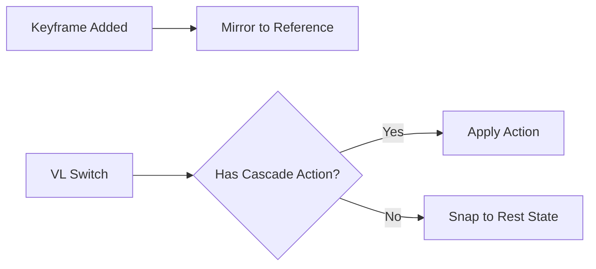

# Rest State

The **Rest State** (reference state) system automatically preserves pristine default property values alongside your per-View Layer animations.

## Concept

When you animate an object differently on each View Layer, you need a "neutral" baseline — the object's default position, rotation, material values, etc. The Rest State system maintains this baseline automatically.

## How It Works

1. A shared **Reference Action** (`Reference_State`) stores the default values for all animated properties at frame 0.
2. When you add a keyframe on any View Layer, the Rest State system automatically mirrors that property's current default value into the Reference Action.
3. When switching View Layers, objects without animation on the target VL snap back to their Rest State values.

## Controls

| Control | Location | Description |
|---------|----------|-------------|
| **Auto-Mirror** | Navigation header / Globals | Toggle automatic reference mirroring on keyframe insert. |
| **Set Reference Default** | Right-click menu / ++shift+alt+i++ | Manually set the current value as the Rest State default. |
| **Revert to Rest** | ++alt+i++ | Snap the selected property back to its Rest State value. |

## Supported Datablocks

The Rest State system covers all standard animatable datablocks:

- Objects (transforms, visibility)
- Lights (energy, color, size)
- Cameras (focal length, DOF)
- Materials (shader properties)
- Worlds (environment settings)
- Scenes (gravity, frame range)
- Node Trees (shader nodes, compositor)

!!! warning "Shape Keys & Pose Bones"
    Shape key values and pose bone transforms are not yet supported by the
    Rest State system. This is planned for a future release.
