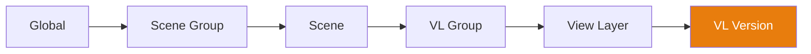

# Sistema Cascade

El **Cascade** (Cascada) es el motor central de Takes for Blender. Resuelve las anulaciones (overrides) de propiedades a través de una jerarquía de 6 niveles (tiers), permitiendo a cualquier nivel anular propiedades del nivel superior.

## Cómo Funciona

Cuando cambias a un View Layer, el cascade resuelve cada propiedad (cámara, mundo, acción, compositor, presets) recorriendo la jerarquía **de arriba a abajo (top-down)** y usando el **primer valor no vacío** que encuentra:

## Niveles de Anulación (Override Tiers)

| Nivel (Tier) | Alcance | Uso de Ejemplo |
|------|-------|-------------|
| **Global** | Todas las escenas, todos los VLs | Cámara predeterminada, mundo global |
| **Scene Group** | Todas las escenas en el grupo | Iluminación exterior compartida |
| **Scene** | Todos los VLs en la escena | Compositor específico de la escena |
| **VL Group** | Todos los VLs en el grupo | Ángulo de cámara compartido |
| **View Layer** | Un único VL | Cámara, acción, mundo por toma |
| **VL Version** | Instantánea nombrada | Ajustes específicos por versión |

## Propiedades en Cascada

Las siguientes propiedades participan en el cascade:

| Propiedad | Descripción |
|----------|-------------|
| **Camera** | Qué objeto cámara se usa para renderizar. |
| **World** | Qué entorno de mundo se utiliza. |
| **Compositor** | Qué árbol de nodos dirige la composición. |
| **Action** | Qué acción de animación está asignada. |
| **Render Preset** | Ajustes de render basados en JSON. |
| **Camera Preset** | Ajustes de cámara basados en JSON. |
| **World Preset** | Ajustes de mundo basados en JSON. |
| **Output Rule** | Regla de ruta de salida basada en etiquetas. |
| **Camera Rule** | Regla de selección de cámara basada en etiquetas. |
| **World Rule** | Regla de selección de mundo basada en etiquetas. |

## Establecer Anulaciones

### A través de los Iconos de Cascade

Haz clic en cualquier icono de cascade en la fila de un árbol para abrir su menú emergente (popover). Establece un valor para crear una anulación en ese nivel, o límpialo para heredar de su elemento padre.

### A través de Context Properties

El panel Context Properties muestra todas las anulaciones para el VL activo en un solo lugar.

## Indicadores Visuales

- **Ícono brillante** — Un valor está establecido explícitamente en este nivel.
- **Ícono atenuado** — El valor se hereda de un nivel superior.
- **Alt+Click** — Limpia la anulación en este nivel actual.

!!! tip "Depuración del Cascade"
    Pasa el cursor (hover) sobre un icono de cascade para ver un texto descriptivo
    mostrando de qué nivel se hereda el valor actual.
