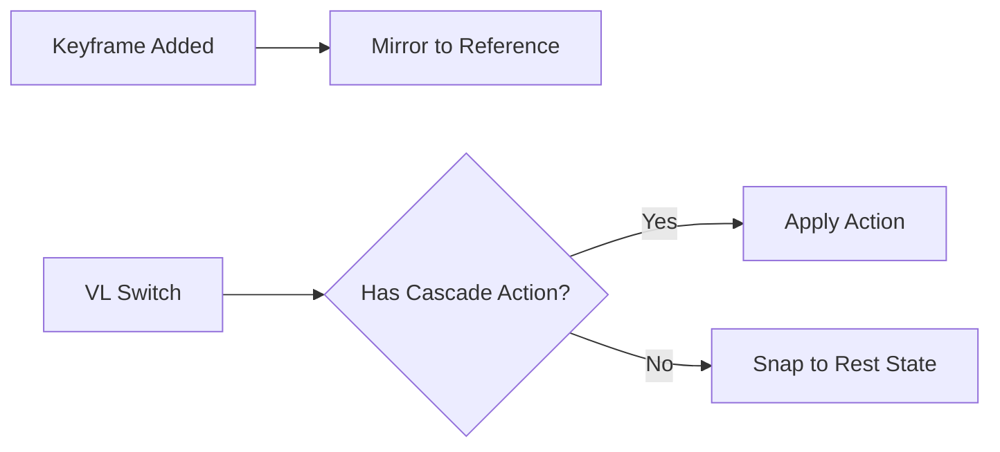

# Rest State (Estado de Reposo)

El sistema de **Rest State** (estado de referencia) preserva automáticamente los valores prístinos de propiedades predeterminadas a la vez que utilizas las animaciones exclusivas del sistema por cada View Layer base.

## El Concepto

A media que manipulas elementos y generas configuraciones independientes por Views (diferentes ejes, vistas de material), requieres poder determinar un objeto o matriz en total neutralidad (una posición base y la rotación originada). Todo control individual se mantiene vigilado para regresar a la normalidad si nada se activa por tu lado en dicho bloque.

## Cómo funciona internamente

1. Un punto especial intermedio llamado **Reference Action** (`Reference_State`) asimila todos esos encuadres sin alterar valores de 0 fotogramas iniciales (frame 0).
2. Cada vez que inicias un movimiento y clavas tus valores (add keyframe), tu propiedad duplicará el valor base con referencia neutra a la acción de protección final del proyecto.
3. Tras ir de un punto A o B, si los objetos que entran a su versión actual y su espacio de cámara no se activan: su formato asimila un regreso limpio sobre la copia a través del uso de Rest State activo general de Blender.

## Sistema y Control 

| Controlador | Sección | Descripción |
|---------|----------|-------------|
| **Auto-Mirror** | Menú Globals / Herramientas iniciales | Activar clon predeterminado tras aplicar keyframes y referencias predeterminadas cruzadas. |
| **Set Reference Default** | Al clic sobre herramientas / ++shift+alt+i++ | Poner la cifra directa referenciada frente a su edición. |
| **Revert to Rest** | Teclas unidas con ++alt+i++ | Ancla automáticamente el objeto a los valores de base neutra sin keyframes adicionales. |

## Bloques Base Implementados Técnicamente (Supported Datablocks)

Estas herramientas aplican íntegramente de cara principal a: 

- Todos tus modelos espaciales con geometría
- Contenidos visuales y de emisión (luz principal o variada)
- Los valores nativamente numéricos (DOF o escala pre-física con zoom focal de cámaras directas integradas)
- Composición principal física basada en la visión predeterminada global. 
- Comodines abstractos globales incluyendo nodos de shader.

!!! warning "Restricciones a Shape Keys"
    La arquitectura base omite controles sobre el sistema de formas o huesos interconectados por animación de mallas (Shape Keys/Pose Bones)
    para este Rest System. La implementación directa estará al nivel de las versiones subsecuentes a publicar integrando soporte futuro para armaduras.
