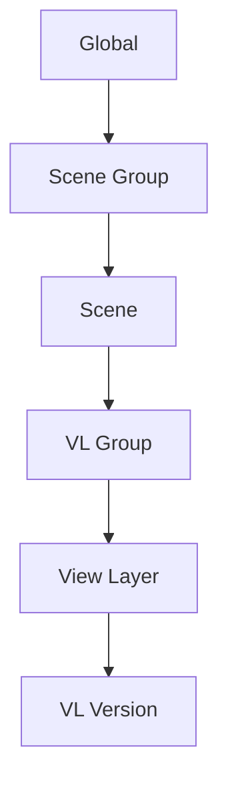

# Primeros Pasos

Esta guía te lleva a través del flujo de trabajo central en menos de 5 minutos.

## Comprendiendo lo Básico

Takes for Blender organiza tu escena en una jerarquía:

Cada nivel en esta jerarquía puede anular (override) propiedades del nivel superior — este es el sistema **Cascade**.

## Tu Primer Take

### 1. Abrir el Panel Takes

Presiona ++n++ en el 3D Viewport para abrir la barra lateral, luego haz clic en la pestaña **Takes**.

El **Takes Tree** muestra todas tus escenas y view layers actuales en una lista unificada.

### 2. Añadir un View Layer

1. Haz clic en el botón **+** en la barra lateral del árbol.
2. Selecciona **Add View Layer**.
3. El nuevo View Layer aparece en el árbol y se vuelve el activo.

### 3. Asignar una Cámara

Cada View Layer puede tener su propia cámara:

1. Selecciona tu nuevo View Layer en el árbol.
2. Haz clic en el **ícono de cámara** (:material-camera:) en la fila del View Layer.
3. En el menú emergente, elige una cámara del desplegable.

### 4. Organizar con Grupos

Agrupa View Layers relacionados juntos:

1. Selecciona un View Layer en el árbol.
2. Presiona ++ctrl+g++ para crear un VL Group.
3. Arrastra otros View Layers dentro del grupo.

### 5. Renderizado por Lotes (Batch Render)

Renderiza todos tus View Layers a la vez:

1. Haz clic en el **botón de Render** (:material-image:) en la barra lateral del árbol.
2. El renderizador por lotes procesa cada View Layer con sus anulaciones en cascada.
3. Los archivos de salida se nombran automáticamente usando el sistema de tokens Smart Output.

## ¿Qué Sigue?

- Aprende sobre el [Sistema Cascade](../features/cascade.md) para comprender cómo fluyen las anulaciones
- Configura [Render Presets](../features/render_presets.md) para ajustes de salida consistentes
- Explora [Variant Switch](../features/variant_switch.md) para variaciones de materiales
