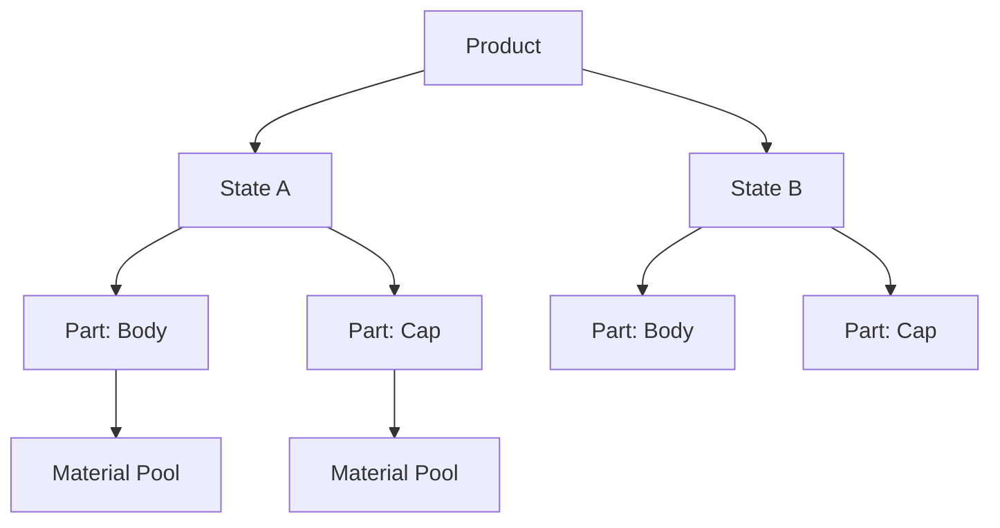

# Variant Tree

**Localización:** *Properties Editor > pestaña Takes > Variant Switch*

El Variant Tree gestiona las variantes de producto — diferentes configuraciones de materiales, opciones de color o estados de tu producto. Usa una estructura jerárquica de Products (Productos), States (Estados) y Parts (Partes).

## Jerarquía

Product
:   El contenedor de nivel superior (ej. "Botella", "Reloj").

State
:   Una variante nombrada del producto (ej. "Oro", "Plata", "Negro Mate").

Part
:   Un componente del producto vinculado a una colección (ej. "Cuerpo", "Tapa", "Correa").
    Cada parte tiene un pool (piscina) de materiales con ranuras (slots) indexadas.

## Uso

### Cambiar de Variantes (Switching Variants)

Haz clic en el **ícono de diamante** en cualquier estado inactivo para previsualizar inmediatamente esa variante en el visor. El estado activo se muestra como un círculo relleno.

### Material Pool

Cada Part (Parte) tiene un material pool — una lista de materiales que pueden ser intercambiados:

1. Asigna un material a la primera ranura vacía (un nuevo slot se auto-creará).
2. Usa el **índice de pool (pool index)** para seleccionar qué material está activo para esa parte.
3. Al cambiar de estados, el sistema cambia los materiales de acuerdo con el índice de pool de cada estado.

### Asignación de Colección

Cada Part está vinculada a una colección de Blender. Todos los objetos en esa colección (y sus subcolecciones) recibirán el intercambio de materiales.

## Etiquetas de Variante (Variant Tags)

Los estados pueden ser etiquetados con la categoría de etiquetas **Variant** para la organización de la salida de tokens Smart Output mediante `{variant_tag}`.
