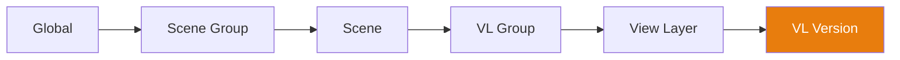

# Cascade-System

Die **Cascade** ist die Kern-Engine von Takes for Blender. Sie löst Eigenschaftsüberschreibungen über eine 6-stufige Hierarchie auf, sodass jede Ebene eine darüber liegende Ebene überschreiben kann.

## So funktioniert es

Wenn Sie zu einer Ansichtsebene wechseln, löst die Kaskade jede Eigenschaft (Kamera, Welt, Aktion, Compositor, Voreinstellungen) auf, indem sie die Hierarchie **von oben nach unten** durchläuft und den **ersten nicht leeren Wert** verwendet, den sie findet:

## Überschreibungsstufen

| Stufe | Geltungsbereich | Anwendungsbeispiel |
|------|-------|-------------|
| **Global** | Alle Szenen, alle VLs | Standardkamera, globale Welt |
| **Szenengruppe** | Alle Szenen in der Gruppe | Gemeinsame Außenbeleuchtung |
| **Szene** | Alle VLs in der Szene | Szenenspezifischer Compositor |
| **VL-Gruppe** | Alle VLs in der Gruppe | Gemeinsamer Kamerawinkel |
| **Ansichtslayer** | Einzelne VL | Kamera, Aktion, Welt pro Aufnahme |
| **VL-Version** | Benannter Snapshot | Versionsspezifische Anpassungen |

## Kaskadeneigenschaften

Die folgenden Eigenschaften sind an der Kaskade beteiligt:

| Eigenschaft | Beschreibung |
|----------|-------------|
| **Kamera** | Welches Kameraobjekt für das Rendering verwendet wird. |
| **Welt** | Welche Weltenumgebung verwendet wird. |
| **Compositor** | Welcher Knotenbaum das Compositing steuert. |
| **Aktion** | Welche Animationsaktion zugewiesen ist. |
| **Render-Voreinstellung** | JSON-basierte Render-Einstellungen. |
| **Kamera-Voreinstellung** | JSON-basierte Kameraeinstellungen. |
| **Welt-Voreinstellung** | JSON-basierte Welteinstellungen. |
| **Ausgaberegel** | Tag-basierte Regel für den Ausgabepfad. |
| **Kamera-Regel** | Tag-basierte Regel für die Kameraauswahl. |
| **Welt-Regel** | Tag-basierte Regel für die Welt-Auswahl. |

## Überschreibungen festlegen

### Über Kaskadensymbole

Klicken Sie auf ein beliebiges Kaskadensymbol in einer Baumzeile, um dessen Popover zu öffnen. Legen Sie einen Wert fest, um eine Überschreibung auf dieser Ebene zu erstellen, oder löschen Sie ihn, um die Einstellung vom übergeordneten Element zu übernehmen.

### Über Kontexteigenschaften

Das Fenster "Kontexteigenschaften" zeigt alle Überschreibungen für die aktive VL an einem Ort an.

## Visuelle Anzeigen

- **Helles Symbol** — Auf dieser Ebene ist ein Wert explizit festgelegt
- **Abgedunkeltes Symbol** — Der Wert wird von einer übergeordneten Ebene geerbt
- **Alt+Klick** — Löscht die Überschreibung auf dieser Ebene

!!! tip "Kaskaden-Debugging"
    Bewegen Sie den Mauszeiger über ein Kaskadensymbol, um einen Tooltip anzuzeigen, der angibt, von welcher Ebene der
    aktuelle Wert geerbt wird.
