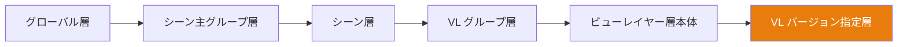

# カスケードシステム (Cascade System)

**カスケード** とは、Takes for Blender における最も心臓部となるコアエンジンです。このシステムは 6つの階層を突き抜けて「プロパティの上書き (オーバーライド)」を解決し、**下位のレベルが、より上位のレベルから受けた命令を、いかなる場合でも自由に上書きできる** 権限構造を提供します。

## それがどのように働くのか (How It Works)

あなたが任意の View Layer に切り替えると、カスケードシステムは各プロパティ（カメラ、ワールド、アクション、コンポジター、各種プリセット等）を決定するために、その階層を **常に上から下へ (top-down)** と歩いてゆき、その道中で見つけた **最初に出会った「空ではない値 (具体的に指定されている値)」** を絶対的な権限として採用 (解決) します：

## オーバーライド権限の各階層 (Override Tiers)

| 階層 (Tier) | 対象とする影響範囲 (Scope) | 具体的な使用例 |
|------|-------|-------------|
| **Global (グローバル)** | 全ての Scene、全ての VLに及ぶ | 絶対たるデフォルトカメラ、プロジェクト全域の共通ワールド |
| **Scene Group (主組)** | この組の配下にある全ての Scene に及ぶ | 共有させたい屋外用のライティング等 |
| **Scene (シーン)** | この Scene 配下にある全ての VL に及ぶ | シーンごとに特化させたいコンポジター |
| **VL Group (小組)** | この組の配下にある全ての VL に及ぶ | 共有させたい全く同じカメラアングル等 |
| **View Layer (VL本体)** | 単一の VL のみ | その一発のショット専用のカメラ、アクション、固有のワールド |
| **VL Version (VL改訂版)** | 名付けられたスナップショット内のみ | バージョン内でだけ変えたい微細な変更点等 |

## カスケードの影響下にあるプロパティ

以下のプロパティがカスケード・チェーン (滝行) への傘下参加プロパティです：

| プロパティ | 説明 |
|----------|-------------|
| **Camera (カメラ)** | どのカメラオブジェクトがレンダリングに使用されるか。 |
| **World (ワールド)** | どのワールド環境が使用されるか。 |
| **Compositor (コンポジター)** | どのノードツリーがコンポジット処理を駆動するか。 |
| **Action (アクション)** | どのアニメーションアクションが割り当てられるか。 |
| **Render Preset (レンダー)** | レンダリング設定の JSON ベースプリセット。 |
| **Camera Preset (カメラP)** | カメラ設定の JSON ベースプリセット。 |
| **World Preset (ワールドP)** | ワールド設定の JSON ベースプリセット。 |
| **Output Rule (出力ルール)** | タグ (Tag) ベースの出力パス名ルール。 |
| **Camera Rule (カメラルール)**| タグ (Tag) ベースのカメラ自動選択ルール。 |
| **World Rule (ワールドルール)** | タグ (Tag) ベースのワールド自動選択ルール。 |

## 上書き命令 (オーバーライド) の設定方法

### カスケードアイコンから

ツリーのいずれかの行にあるカスケードアイコンをクリックすると、その専用のポップオーバーメニューが開きます。そこで具体的な値をセットして「その階層レベルでの上書き命令」を作成するか、あるいは値をクリアして「親からの命令をただ素直に継承する」状態に戻すか決めます。

### コンテキストプロパティパネルから

「Context Properties」のパネルを見れば、現在アクティブになっている VL に対して「今、どのような上書き命令が下って適用されているのか」を全て一目瞭然に確認できます。

## 視覚的な権限インジケーター (Visual Indicators)

- **明るい単色アイコン** — まさにこの階層レベルにて、強力な値が明示的（明定的）にセットされ、権限を持っている状態
- **暗くくすんだアイコン** — 強い権限を持つ親階層からの指示を、ただおとなしく継承して受け取っている状態
- **++alt+click++** — その階層レベルでの自発的な上書き設定（オーバーライド）を瞬時にクリア (放棄) します

!!! tip "カスケードのデバッグ・追跡"
    カスケードアイコンの上にマウスカーソルを静かにホバー (停止) させると、現在の値が
    「どの階層の親から」継承されて降りてきたものなのかを示す、ツールチップが表示されます。
