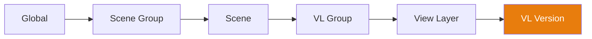

# Cascade System

The **Cascade** is the core engine of Takes for Blender. It resolves property overrides through a 6-tier hierarchy, allowing any level to override any level above it.

## How It Works

When you switch to a View Layer, the cascade resolves each property (camera, world, action, compositor, presets) by walking the hierarchy **top-down** and using the **first non-empty value** it finds:

## Override Tiers

| Tier | Scope | Example Use |
|------|-------|-------------|
| **Global** | All scenes, all VLs | Default camera, global world |
| **Scene Group** | All scenes in the group | Shared exterior lighting |
| **Scene** | All VLs in the scene | Scene-specific compositor |
| **VL Group** | All VLs in the group | Shared camera angle |
| **View Layer** | Single VL | Per-shot camera, action, world |
| **VL Version** | Named snapshot | Version-specific tweaks |

## Cascade Properties

The following properties participate in the cascade:

| Property | Description |
|----------|-------------|
| **Camera** | Which camera object is used for rendering. |
| **World** | Which world environment is used. |
| **Compositor** | Which node tree drives compositing. |
| **Action** | Which animation action is assigned. |
| **Render Preset** | JSON-based render settings. |
| **Camera Preset** | JSON-based camera settings. |
| **World Preset** | JSON-based world settings. |
| **Output Rule** | Tag-based output path rule. |
| **Camera Rule** | Tag-based camera selection rule. |
| **World Rule** | Tag-based world selection rule. |

## Setting Overrides

### Via Cascade Icons

Click any cascade icon on a tree row to open its popover. Set a value to create an override at that level, or clear it to inherit from the parent.

### Via Context Properties

The Context Properties panel shows all overrides for the active VL in one place.

## Visual Indicators

- **Bright icon** — A value is explicitly set at this tier
- **Dimmed icon** — The value is inherited from a parent tier
- **Alt+Click** — Clear the override at this tier

!!! tip "Cascade Debugging"
    Hover over a cascade icon to see a tooltip showing which tier the
    current value is inherited from.
