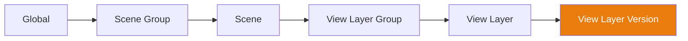

# Cascade System

The **Cascade** is the core engine of Takes for Blender. It resolves property overrides through a 6-tier hierarchy, allowing any level to override any level above it.

## :material-cog-sync: How It Works

When you switch to a View Layer, the cascade resolves each property (camera, world, action, compositor, presets) by walking the hierarchy from the **most specific tier upward** and using the **first non-empty value** it finds. View Layer Version wins over View Layer, View Layer wins over View Layer Group, and so on up to Global as the final fallback:

The arrow direction shows hierarchy (Global is the parent, View Layer Version is the leaf). Resolution priority runs in the **opposite** direction — leaf wins over root.

## :material-stairs: Override Tiers

| Tier | Scope | Example Use |
|------|-------|-------------|
| **Global** | All scenes, all View Layers | Default camera, global world |
| **Scene Group** | All scenes in the group | Shared exterior lighting |
| **Scene** | All View Layers in the scene | Scene-specific compositor |
| **View Layer Group** | All View Layers in the group | Shared camera angle |
| **View Layer** | Single View Layer | Per-shot camera, action, world |
| **View Layer Version** | Named snapshot | Version-specific tweaks |

## :material-format-list-bulleted-type: Cascade Properties

Two cascade resolvers live alongside each other. They walk the same 6-tier chain but answer different questions, so the wiki splits them into separate tables to match the source.

### :material-link-variant: Pointer Cascade

These are the cascade's "primary" properties — each one resolves a single datablock reference (or a single rule name) and is driven by the `CascadeProperty` enum / `resolve_cascade` resolver. Each shows up as its own cascade icon on every tree row.

| Property | Resolves to | Description |
|----------|-------------|-------------|
| **Camera** | Camera object | Which camera object is used for rendering. |
| **World** | World datablock | Which world environment is used. |
| **Compositor** | Node tree | Which node tree drives compositing. |
| **Action** | Action datablock | Cascade action applied to managed objects on this View Layer. |
| **Output Rule** | Tag name | The active automation rule that drives the five output-side preset slots. |

### :material-format-list-checkbox: Per-field Cascade

These are name-keyed preset slots and selection rules. Each one cascades independently via the generic `get_cascade_winner` resolver, so a Scene-level Render preset can win while a VL-level Color Management preset overrides it. The Output Popover groups the five output-side slots in one place; Camera Rule and World Rule are surfaced via the Camera and World popovers.

| Slot / rule | Driven by | Description |
|-------------|-----------|-------------|
| **Render preset** | `tks_render_preset` | Engine, samples, resolution. |
| **Output preset** | `tks_output_preset` | Container, dimensions, frame range. |
| **File Output preset** | `tks_fileoutput_preset` | Format, color depth, compression, Smart Output paths. |
| **View Layer preset** | `tks_viewlayer_preset` | Active passes, light groups, holdouts. |
| **Color Management preset** | `tks_colormanagement_preset` | View transform, look, exposure. |
| **Camera preset** | `tks_camera_preset` | Focal length, sensor, DOF. Applied to the cascade-resolved camera. |
| **World preset** | `tks_world_preset` | Background, strength, mist. Applied to the cascade-resolved world. |
| **Camera Rule** | `tks_camera_rule` | Tag-based automatic camera selection. |
| **World Rule** | `tks_world_rule` | Tag-based automatic world selection. |

## :material-pencil: Setting Overrides

### :material-cursor-default-click: Via Cascade Icons
Click any cascade icon on a tree row to open its popover. Set a value to create an override at that level, or clear it to inherit from the parent.

### :material-tune-vertical: Via Context Properties
The Context Properties panel shows all overrides for the active View Layer in one place.

### :material-plus-box: Creating Datablocks per Tier

The Action, World, Camera and Compositor popovers carry a **+** button (:material-plus:) next to their picker — from the Global tier all the way down (tier coverage varies per type, see the table). Clicking it creates a brand-new datablock — auto-named from the [Smart Output](smart_output.md) naming template for the tier you're on — marks it with a fake user so it survives a save/reload, and assigns it to that tier in one step. This saves you from creating a datablock in Blender's own browser and then pointing the cascade at it.

| Operator | Button | Creates and assigns to |
|----------|--------|------------------------|
| `tks.global_action_new` | **{{ op('tks.global_action_new').bl_label }}** | A new Action on the **Global** tier. |
| `tks.scene_action_new` | **New Action** | A new Action on the **Scene** tier. |
| `tks.vl_action_new` | **New Action** | A new Action on the **View Layer** tier. |
| `tks.scene_world_new` | **New World** | A new World on the **Scene** tier. |
| `tks.vl_world_new` | **New World** | A new World on the **View Layer** tier. |
| `tks.global_camera_new` | **{{ op('tks.global_camera_new').bl_label }}** | A new Camera on the **Global** tier. |
| `tks.scene_camera_new` | **New Camera** | A new Camera on the **Scene** tier. |
| `tks.vl_camera_new` | **New Camera** | A new Camera on the **View Layer** tier. |
| `tks.global_compositor_new` | **{{ op('tks.global_compositor_new').bl_label }}** | A new compositor node tree on the **Global** tier. |
| `tks.group_compositor_new` | **New Compositor** | A new compositor node tree on a **Scene Group**, **View Layer Group**, or **View Layer Version** (one shared operator serves all three group tiers). |
| `tks.scene_compositor_new` | **New Compositor** | A new compositor node tree on the **Scene** tier. |
| `tks.vl_compositor_new` | **New Compositor** | A new compositor node tree on the **View Layer** tier. |
| `tks.rest_action_new` | **New Rest Action** | A new Action assigned as the **Rest Action** (see below). |

!!! note "Rest Action"
    The **New Rest Action** button lives on the Rest State popover, not the cascade tier itself. The Rest Action is the snapshot that *unkeyed* properties fall back to: any property without a keyframe snaps to its value in the Rest Action. Creating one here gives you an empty action to pose into as your neutral / rest baseline.

### :material-pencil: Renaming Without Breaking Anything

Cascade assignments are stored by *name*, so renaming a datablock in Blender's own UI would orphan every assignment pointing at it. The popovers therefore carry a **pencil** button, **{{ op('tks.casic_rename').bl_label }}** (`tks.casic_rename`): it renames the assigned Action / World / Camera / Compositor in a small dialog *and* rewrites every cascade reference to the old name across all tiers in the same step — so the rename can never break an assignment.

### :material-delete-forever: Deleting Assigned Data

++ctrl+shift+alt++-clicking any cascade datablock icon (Action / World / Camera / Compositor, any tier) invokes **{{ op('tks.purge_assigned_data').bl_label }}** (`tks.purge_assigned_data`) — deliberately hidden behind a three-key chord so it can't fire by accident. Its confirmation dialog spells out the full blast radius before you commit: every cascade location the datablock is assigned in, its user count in the file, and whether fake-user protection will be overridden (cameras additionally note that only the object is deleted, its camera data stays). Confirming unassigns the datablock from every slot, then deletes it from the file.

## :material-eye-outline: Visual Indicators

- **Bright icon** — A value is explicitly set at this tier
- **Dimmed icon** — The value is inherited from a parent tier
- **Alt+Click** — Clear the override at this tier

!!! tip "Cascade Debugging"
    Hover over a cascade icon to see a tooltip showing which tier the
    current value is inherited from.

## :material-account-multiple-check: Managing the Cascade Action

The **Action** cascade is special: it doesn't just point at a datablock, it actively pushes that action onto every managed (watched) object on the View Layer. A few operators help keep that in sync:

| Action | Operator | What it does |
|--------|----------|--------------|
| **Re-apply Cascade Action** | `tks.reapply_cascade_action` | Forces the resolved cascade action back onto all watched objects, updates the depsgraph for an immediate viewport refresh, and clears the "action mismatch" entry from the navigation warnings. Use it after manually fiddling with an object's animation data. |
| **Pin Action** | `tks.pin_action_override` | Locks the action *currently* active on an object into that object's own override, so the cascade will leave it alone instead of overwriting it on the next switch. Reports a warning if the object has no action to pin. |
| **Push to Selected** | `tks.push_override_to_selected` | Copies one override value from the active Scene / View Layer to every multi-selected View Layer at once. Works for Camera, World, Action, Compositor, Output Rule, and Variant. Pushing an empty value clears that override on the targets. The button only appears while a multi-selection is active. |
| **{{ op('tks.update_action_name').bl_label }}** | `tks.update_action_name` | Renames the assigned Scene- or View-Layer cascade action to match the current naming template — useful when generated action names have gone stale after renaming a scene or View Layer. No panel button; run it from Blender's operator search. |
| **{{ op('tks.scene_action_unlink').bl_label }}** | `tks.scene_action_unlink` | Clears the current scene's Scene-tier action assignment (the action datablock itself stays in the file). Also operator-search only — the popover's ++alt++-click clear is the everyday route. |

!!! tip "Bulk editing with Push to Selected"
    Select several View Layers in the tree, set the value once on one of them, then use **Push to Selected** to fan it out — handy for giving a batch of shots the same camera or world without touching each row.

## :material-camera-switch: Cross-Scene Camera Linking

When you assign a camera at the **Global** or **Scene Group** tier, that camera has to exist in *every* scene the tier covers. If it doesn't, picking it pops up the **Camera not linked in all scenes** confirmation (`tks.link_camera_and_assign`) listing the missing scenes and offering three choices:

- **Link & Assign** — link the camera into each missing scene (mirroring its current collection placement) and then assign it.
- **Just Assign** — keep the assignment at the source tier and let the cascade silently skip scenes where it can't resolve.
- **Cancel** — do nothing.

The cascade picker also flags an incompatible camera with an error icon before you click, so you can spot the situation in advance.

## :material-vector-difference: Version Variants

[View Layer Versions](#override-tiers) can override which **variant** of a product is shown — this is the highest-priority tier in the [Variant Switch](variant_switch.md) cascade, so a version's choice wins over everything below it. The version's variant popover exposes two operators:

| Action | Operator | What it does |
|--------|----------|--------------|
| **Set Version Variant** | `tks.vlv_set_variant` | Pins a specific product to a chosen variant index on this version. If the version is currently active, the variant cascade re-applies immediately. |
| **Clear Version Variant** | `tks.vlv_clear_variant` | Removes that product's variant override from the version, letting it inherit again. Re-applies live if the version is active. |

## :material-link-off: Broken Assignments

Because cascade assignments are stored by name, an assignment **breaks** when the datablock behind it disappears — deleted, or renamed outside the addon's own [rename tool](#renaming-without-breaking-anything). The cascade can then no longer resolve that slot, and a warning sub-panel appears in the Navigation panel's warning row listing every broken reference with its data type and tier.

The panel repairs as well as reports:

- **X** on an entry runs **{{ op('tks.clear_broken_assignment').bl_label }}** (`tks.clear_broken_assignment`), emptying the stale reference(s) to that one datablock; a type row's **Empty all** button clears every broken reference of that data type at once.
- The **magnifier** button runs **{{ op('tks.replace_broken_assignment').bl_label }}** (`tks.replace_broken_assignment`), which reopens that exact tier's cascade popover so you can point the slot at a replacement instead of clearing it.
- **Clear All** at the top runs **{{ op('tks.clear_all_broken_assignments').bl_label }}** (`tks.clear_all_broken_assignments`), emptying every broken cascade assignment in the file in one click.

Clearing only empties the stored reference — nothing is deleted — and the warning disappears as soon as every assignment resolves again.

## :material-compare-horizontal: Cascade & Preset Drift

**Drift** is the opposite failure mode: the assignment is fine, but the *live* value no longer matches it — you changed the world or compositor through Blender's native UI instead of the cascade, or edited settings governed by one of the tier-cascaded preset slots (Render, Output, File Output, View Layer, Color Management, World, Camera). The addon compares the scene's current state against what the cascade last applied and lists each mismatch in a Navigation warning, with a ✓ / ↩ pair per entry:

| Button | Operator | What it does |
|--------|----------|--------------|
| ✓ on a World / Compositor row | **{{ op('tks.accept_cascade_drift').bl_label }}** (`tks.accept_cascade_drift`) | Adopts your manual pick — writes it into the active View Layer's assignment, so the cascade owns the new value from now on. |
| ↩ on a World / Compositor row | **{{ op('tks.revert_cascade_drift').bl_label }}** (`tks.revert_cascade_drift`) | Discards the manual change and re-applies the cascade-resolved value. |
| ✓ on a preset row | **{{ op('tks.accept_preset_drift').bl_label }}** (`tks.accept_preset_drift`) | Pushes the drifted preset assignment onto the active View Layer's cascade tier. |
| ↩ on a preset row | **{{ op('tks.revert_preset_drift').bl_label }}** (`tks.revert_preset_drift`) | Restores the cascade-assigned preset. |

The rule of thumb: **Accept** when the change was intentional and should stick to this shot; **Revert** when it was an accidental edit in the wrong panel. (Don't confuse this with the preset *dirty state* — drift is about which datablock or preset is assigned, dirty state is about edited values inside an assigned preset; see [Render Presets](render_presets.md#dirty-state).)

## :material-dots-horizontal-circle: Overflow Icon

On narrow panels the per-row cascade icons collapse behind a single **overflow** indicator. Clicking it (`tks.overflow_icon_click`) opens the inline editor for the chosen cascade property; ++alt++ + clicking instead clears **every** assignment for that property at that tier in one go — the direct value, its selection rule, *and* its preset slot together. The status line reports how many values were cleared (or that the slot was already empty).

## :material-keyboard: Hotkeys

Cascade icons on tree rows and in the Context panel respond to modifier-clicks:

| Shortcut | Action |
|----------|--------|
| Click | Open the popover for this property. |
| ++alt++ + click | Clear the override at this tier (revert to inherited value). |
| ++shift++ + click | Toggle the same property across **all items of the same type** in the active scene. |
| ++ctrl+shift++ + click | Toggle the same property **globally** across every scene and group. |
| ++ctrl+shift+alt++ + click | **Delete** the assigned datablock from the file, after a blast-radius confirmation — see [Deleting Assigned Data](#deleting-assigned-data). |

Datablock pickers (Camera, World, Compositor, Action) follow the same convention — ++alt++ + click clears the assignment.

See the full reference on the [Keyboard Shortcuts](../interface/hotkeys.md) page.
