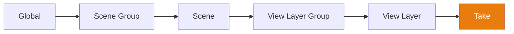

# Cascade System

The cascade decides which camera, world, action, compositor and presets a take uses.

You set a value on any level. Deeper levels win over higher ones.

```mermaid
graph LR
    Global[Global] --> SceneGrp[Scene Group]
    SceneGrp --> Scene[Scene]
    Scene --> LayerGroup[View Layer Group]
    LayerGroup --> Layer[View Layer]
    Layer --> Take[Take]

    style Take fill:#e87d0d,color:#fff
```

The arrows show who contains whom. Winning runs the other way: a Take beats everything above it.

## :material-stairs: Override Tiers

Six levels, from widest to narrowest.

| Tier | Covers | Typical use |
|------|--------|-------------|
| **Global** | Everything | Default camera and world |
| **Scene Group** | Every scene in the group | Shared exterior lighting |
| **Scene** | Every View Layer in the scene | Scene compositor |
| **View Layer Group** | Every View Layer in the group | Shared camera angle |
| **View Layer** | One View Layer | Per-shot camera, action, world |
| **Take** | One saved review round | Tweaks between review rounds |

??? info "Which properties cascade"
    Two resolvers run side by side over the same six tiers.

    **Single-value properties.** Each gets its own icon on every tree row.

    | Property | Resolves to |
    |----------|-------------|
    | **Camera** | The camera object used for rendering. |
    | **World** | The world environment. |
    | **Compositor** | The node tree that drives compositing. |
    | **Action** | The action pushed onto managed objects on this View Layer. |
    | **Output Rule** | The automation rule driving the five output preset slots. |

    **Preset slots and rules.** Each cascades on its own, so a Scene-level Render
    preset can win while a View Layer Color Management preset overrides it.

    | Slot / rule | Holds |
    |-------------|-------|
    | **Render preset** | Engine, samples, resolution. |
    | **Output preset** | Container, dimensions, frame range. |
    | **File Output preset** | Format, colour depth, compression, Smart Output paths. |
    | **View Layer preset** | Active passes, light groups, holdouts. |
    | **Color Management preset** | View transform, look, exposure. |
    | **Camera preset** | Focal length, sensor, depth of field. |
    | **World preset** | Background, strength, mist. |
    | **Camera Rule** | Tag-based automatic camera choice. |
    | **World Rule** | Tag-based automatic world choice. |

## :material-pencil: Setting Overrides

Click a cascade icon on any tree row. Set a value to override, or clear it to inherit again.

A **bright** icon means the value is set here. A **dimmed** icon means it came from above.

The Context Properties panel shows every override for the active View Layer in one place.

??? tip "Modifier clicks on a cascade icon"
    | Shortcut | Action |
    |----------|--------|
    | Click | Open the popover for this property. |
    | ++alt++ + click | Clear the override at this tier. |
    | ++shift++ + click | Toggle it across all items of the same type in the scene. |
    | ++ctrl+shift++ + click | Toggle it across every scene and group. |
    | ++ctrl+shift+alt++ + click | Delete the datablock — see [Deleting Assigned Data](#deleting-assigned-data). |

    Hover any icon to see which tier the current value came from.
    Datablock pickers follow the same rules. Full list on
    [Keyboard Shortcuts](../interface/hotkeys.md).

### :material-plus-box: Creating Datablocks per Tier

The Action, World, Camera and Compositor popovers each have a **+** button.

It makes a new datablock, names it from your [Smart Output](smart_output.md) template, protects it from cleanup, and assigns it here — in one click.

??? info "Which tiers offer a + button"
    | Button | Creates and assigns to |
    | -------- | ------------------------ |
    | **{{ op('tks.global_action_new').bl_label }}** | A new Action on the **Global** tier. |
    | **New Action** | A new Action on the **Scene** tier. |
    | **New Action** | A new Action on the **View Layer** tier. |
    | **New World** | A new World on the **Scene** tier. |
    | **New World** | A new World on the **View Layer** tier. |
    | **{{ op('tks.global_camera_new').bl_label }}** | A new Camera on the **Global** tier. |
    | **New Camera** | A new Camera on the **Scene** tier. |
    | **New Camera** | A new Camera on the **View Layer** tier. |
    | **{{ op('tks.global_compositor_new').bl_label }}** | A new compositor node tree on the **Global** tier. |
    | **New Compositor** | A new node tree on a **Scene Group**, **View Layer Group**, or **Take**. |
    | **New Compositor** | A new node tree on the **Scene** tier. |
    | **New Compositor** | A new node tree on the **View Layer** tier. |
    | **New Rest Action** | A new Action set as the **Rest Action**. |

    **New Rest Action** sits on the Rest State popover, not on a cascade tier. The
    Rest Action is what *unkeyed* properties fall back to. Creating one here gives
    you an empty action to pose into as your neutral baseline.

### :material-pencil: Renaming Without Breaking Anything

Assignments are stored by name. Renaming in Blender's own UI would orphan them.

So use the **pencil** button in the popover instead. It renames the datablock *and* fixes every reference to it, everywhere, in one step.

### :material-delete-forever: Deleting Assigned Data

++ctrl+shift+alt++-click any cascade icon to delete that datablock from the file.

The three-key chord stops accidents. A dialog lists the full blast radius first.

??? warning "What the dialog tells you"
    It names every cascade slot the datablock is assigned to, how many users it has
    in the file, and whether fake-user protection will be overridden. For a camera
    it notes that only the object is deleted — the camera data stays.

    Confirming unassigns it everywhere, then deletes it.

## :material-account-multiple-check: Managing the Cascade Action

The Action cascade is special. It does not just point at an action — it pushes that action onto every watched object on the View Layer.

Three buttons keep it in sync.

| Button | What it does |
| -------- | -------------- |
| **Re-apply Cascade Action** | Puts the resolved action back on every watched object. Use it after hand-editing an object's animation. |
| **Pin Action** | Locks the object's current action so the cascade leaves it alone. |
| **Push to Selected** | Copies one value from the active row to every selected View Layer. Appears only during a multi-selection. |

??? info "Two more, from operator search only"
    | Action | What it does |
    | -------- | -------------- |
    | **{{ op('tks.update_action_name').bl_label }}** | Renames the assigned cascade action to match the current naming template. Useful when names go stale after renaming a scene or View Layer. |
    | **{{ op('tks.scene_action_unlink').bl_label }}** | Clears the scene's Scene-tier action assignment. The action itself stays in the file. The popover's ++alt++-click is the everyday route. |

    **Bulk tip.** Select several View Layers, set the value once, then
    **Push to Selected** to fan it out. Handy for giving a batch of shots the same
    camera or world.

## :material-camera-switch: Cross-Scene Camera Linking

A camera set at **Global** or **Scene Group** must exist in every scene that tier covers.

If it does not, those takes are quietly skipped. Picking still assigns — the gap is flagged afterwards, not blocked by a dialog.

You will see it in three places: a red camera flag on the tree row, the **Camera Links** warning in the Navigation panel, and the camera picker itself.

??? info "Fixing it"
    All three run the same repair, which links the camera into the missing scenes.
    Nothing is duplicated — it stays one camera object.

    | Button | Where | Scope |
    |--------|-------|-------|
    | **Link** | A scene row in the Camera Links warning | That one scene. |
    | **Link into all missing scenes** | Footer of a camera's entry | Every scene the tier covers. Scenes that already have it are skipped. |
    | **Link '&lt;camera&gt;' into this scene** | The cascade camera picker | The scene you are in. |

    The warning clears once every covered scene can resolve the camera.

    **Three camera problems, three warnings.** Camera Links means the camera exists
    but cannot reach some scenes. A [broken assignment](#broken-assignments) means the
    camera is gone. [Drift](#cascade-preset-drift) means one was picked outside the tree.

## :material-vector-difference: Take Variants {: #version-variants }

A [take](#override-tiers) can choose which **variant** of a product shows.

This is the top tier of the [Variant Switch](variant_switch.md) cascade, so it beats everything below.

**Set Take Variant** pins a product to a variant. **Clear Take Variant** lets it inherit again. Both apply live if the take is active.

## :material-link-off: Broken Assignments

An assignment **breaks** when the thing behind it is gone — deleted, or renamed outside the [rename tool](#renaming-without-breaking-anything).

A warning in the Navigation panel lists every broken reference, and repairs them.

??? info "The repair buttons"
    - **X** empties the stale reference to that one datablock. A type row's
      **Empty all** clears every broken reference of that type.
    - The **magnifier** reopens that tier's popover so you can pick a replacement
      instead of clearing.
    - **Clear All** empties every broken assignment in the file at once.

    Clearing only empties the stored reference — nothing is deleted. The warning
    goes away once everything resolves again.

## :material-alert-circle-outline: Camera or World Needed {: #needed-rows }

This is the other half of a broken assignment: nothing is assigned *anywhere*, and the scene has no camera or world to fall back on.

The Navigation panel says so and gives you two chips to fix it on the spot.

**▾** opens a search popup and writes your pick to the adopt tier. **+** creates one, assigns it, and — for a camera — aligns it to your current view.

??? info "Which tier the chips write to"
    Not fixed. It follows your *Camera handling* and *World handling* preferences
    (see [Globals](globals.md)). A studio that manages everything on the Scene tier
    and one that works per View Layer both get a button that lands in the right place.

    When the row appears because a camera was *removed* rather than never assigned,
    it also names what was removed, so you can put the same one back.

## :material-compare-horizontal: Cascade & Preset Drift

**Drift** is the opposite problem. The assignment is fine, but the live value no longer matches it.

It happens when you change a world or compositor in Blender's own UI, or edit settings owned by a preset slot.

Each mismatch gets a ✓ / ↩ pair. **✓** keeps your change and writes it into the cascade. **↩** throws it away and re-applies the cascade value.

??? tip "Which one to click"
    **✓** when the change was deliberate and should stick to this shot.
    **↩** when it was an accidental edit in the wrong panel.

    Don't confuse drift with a preset's *dirty state*. Drift is about *which*
    preset or datablock is assigned. Dirty state is about edited values *inside*
    an assigned preset — see [Render Presets](render_presets.md#dirty-state).

## :material-dots-horizontal-circle: Overflow Icon

On a narrow panel the row icons collapse behind one **overflow** dot.

Click it to open the editor for a property. ++alt++-click clears **everything** for that property at that tier — the value, its rule, and its preset slot together.
