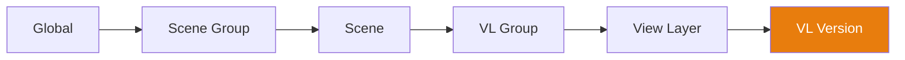

# Система Каскада (Cascade System)

**Каскад (Cascade)** — это стержневой движок Takes for Blender. Он разрешает переопределения (overrides) свойств через 6-уровневую иерархию, позволяя любому уровню переопределять любой уровень выше него.

## Как это работает

При переключении на View Layer движок каскада разрешает каждое свойство (камеру, окружение, анимацию, композитор, пресеты), проходя по иерархии **сверху вниз (top-down)**, и использует **первое найденное непустое значение**:

## Уровни переопределений (Override Tiers)

| Уровень | Область охвата | Пример использования |
|------|-------|-------------|
| **Глобальный (Global)** | Все сцены, все VL | Камера по умолчанию, глобальное освещение |
| **Группа Сцен (Scene Group)** | Все сцены в группе | Общее внешнее освещение |
| **Сцена (Scene)** | Все VL внутри сцены | Специфический композитор для сцены |
| **Группа VL (VL Group)** | Все VL внутри группы | Общий ракурс камер для вариантов |
| **Слой (View Layer)** | Один отдельный VL | Камера, анимация и окружение конкретно для кадра |
| **Версия VL (VL Version)** | Именованный снимок (snapshot) | Специфичные правки под версию |

## Свойства в Каскаде

Следующие свойства участвуют в работе каскада:

| Свойство | Описание |
|----------|-------------|
| **Камера (Camera)** | Какой объект камеры используется для рендера. |
| **Окружение (World)** | Какая среда (World environment) используется. |
| **Композитор (Compositor)** | Какое дерево нодов управляет композитингом. |
| **Действие (Action)** | Какое анимационное действие (action) назначено. |
| **Render Preset** | Настройки рендера на основе JSON. |
| **Camera Preset** | Настройки камеры на основе JSON. |
| **World Preset** | Настройки мирового окружения (world) на основе JSON. |
| **Output Rule** | Правило пути сохранения (на основе тегов). |
| **Camera Rule** | Правило автоматического выбора камеры (на основе тегов). |
| **World Rule** | Правило автоматического подбора окружения. |

## Установка переопределений (Setting Overrides)

### Через значки каскада

Щелкните по любому значку каскада в строке дерева, чтобы открыть всплывающее меню (popover). Установите в нем необходимое значение, чтобы создать жесткое переопределение на этом уровне, или очистите его, чтобы оно наследовалось от родительского узла.

### Через Свойства Контекста (Context Properties)

Панель Context Properties показывает все текущие переопределения для активного на данный момент VL в одном едином месте.

## Визуальные индикаторы

- **Яркий значок** — Значение было явно задано конкретно на этом уровне (tier).
- **Тусклый значок** — Значение наследуется от одного из родительских уровней.
- **Alt+Click** — Очистить текущее переопределение (override) персонально на этом уровне.

!!! tip "Отладка каскада (Cascade Debugging)"
    Наведите курсор мыши на значок каскада, чтобы увидеть всплывающую подсказку (tooltip), показывающую, с какого именно родительского уровня наследуется текущее используемое значение.
