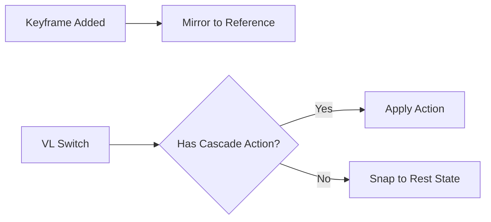

# Ruhezustand

Das System des **Ruhezustands** (Referenzzustand) bewahrt automatisch die ursprünglichen Standardwerte der Eigenschaften neben Ihren Animationen auf den einzelnen Ansichtsebenen.

## Konzept

Wenn Sie ein Objekt auf jeder Ansichtsebene unterschiedlich animieren, benötigen Sie eine "neutrale" Basislinie – die Standardposition, -rotation, Materialwerte usw. des Objekts. Das System des Ruhezustands verwaltet diese Basislinie automatisch.

## So funktioniert es

1. Eine gemeinsame **Referenzaktion** (`Reference_State`) speichert die Standardwerte für alle animierten Eigenschaften bei Frame 0.
2. Wenn Sie auf einer beliebigen Ansichtsebene einen Keyframe hinzufügen, spiegelt das Ruhezustandssystem automatisch den aktuellen Standardwert dieser Eigenschaft in der Referenzaktion wider.
3. Beim Wechseln der Ansichtsebenen springen Objekte ohne Animation auf der Ziel-Ansichtsebene zurück zu ihren Ruhezustandswerten.

## Steuerelemente

| Steuerelement | Position | Beschreibung |
|---------|----------|-------------|
| **Auto-Spiegelung** | Navigationsleiste / Globals | Automatische Referenzspiegelung beim Einfügen von Keyframes aktivieren. |
| **Referenzstandard festlegen** | Rechtsklick-Menü / ++Shift+Alt+i++ | Den aktuellen Wert manuell als Rest-State-Standard festlegen. |
| **Auf Rest zurücksetzen** | ++Alt+i++ | Die ausgewählte Eigenschaft auf ihren Rest-State-Wert zurücksetzen. |

## Unterstützte Datenblöcke

Das Ruhezustandssystem deckt alle standardmäßigen animierbaren Datenblöcke ab:

- Objekte (Transformationen, Sichtbarkeit)
- Lichter (Energie, Farbe, Größe)
- Kameras (Brennweite, DOF)
- Materialien (Shader-Eigenschaften)
- Welten (Umgebungseinstellungen)
- Szenen (Schwerkraft, Frame-Bereich)
- Knotenbäume (Shader-Knoten, Compositor)

!!! warning "Shape Keys & Pose Bones"
    Shape-Key-Werte und Pose-Bone-Transformationen werden vom
    Rest-State-System noch nicht unterstützt. Dies ist für eine zukünftige Version geplant.
