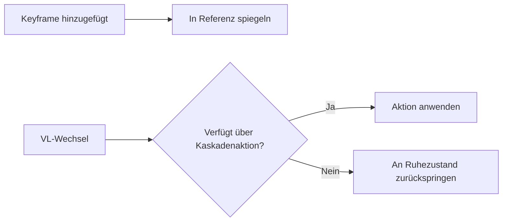

# Ruhezustand

Das System des **Ruhezustands** (Referenzzustand) bewahrt automatisch die ursprünglichen Standardwerte der Eigenschaften neben Ihren Animationen auf den einzelnen Ansichtsebenen.

## Konzept

Wenn Sie ein Objekt auf jeder Ansichtsebene unterschiedlich animieren, benötigen Sie eine „neutrale“ Basislinie – die Standardposition, -rotation, Materialwerte usw. des Objekts. Das System des Ruhezustands verwaltet diese Basislinie automatisch.

## So funktioniert es

1. Eine gemeinsame **Referenzaktion** (`Reference_State`) speichert die Standardwerte für alle animierten Eigenschaften bei Frame 0.
2. Wenn Sie auf einer beliebigen Ansichtsebene einen Keyframe hinzufügen, spiegelt das Ruhezustandssystem automatisch den aktuellen Standardwert dieser Eigenschaft in die Referenzaktion.
3. Beim Wechseln der Ansichtsebenen springen Objekte ohne Animation auf der Ziel-VL zurück zu ihren Ruhezustandswerten.

## Steuerelemente

| Steuerelement | Position | Beschreibung |
|---------|----------|-------------|
| **Auto-Spiegeln** | Navigationsleiste / Globals | Automatisches Spiegeln der Referenz beim Einfügen eines Keyframes umschalten. |
| **Referenz als Standard festlegen** | Rechtsklick-Menü / ++Shift+Alt+i++ | Den aktuellen Wert manuell als Standard für den Ruhezustand festlegen. |
| **Zurück zum Ruhezustand** | ++Alt+i++ | Die ausgewählte Eigenschaft wieder auf ihren Wert im Ruhezustand zurücksetzen. |

## Unterstützte Datenblöcke

Das Ruhezustandssystem deckt alle standardmäßigen animierbaren Datenblöcke ab:

- Objekte (Transformationen, Sichtbarkeit)
- Lichter (Energie, Farbe, Größe)
- Kameras (Brennweite, DOF)
- Materialien (Shader-Eigenschaften)
- Welten (Umgebungseinstellungen)
- Szenen (Schwerkraft, Frame-Bereich)
- Knotenbäume (Shader-Knoten, Compositor)

!!! Warnung „Shape Keys & Pose Bones“
    Shape-Key-Werte und Pose-Bone-Transformationen werden vom
    Ruhezustandssystem noch nicht unterstützt. Dies ist für eine zukünftige Version geplant.
