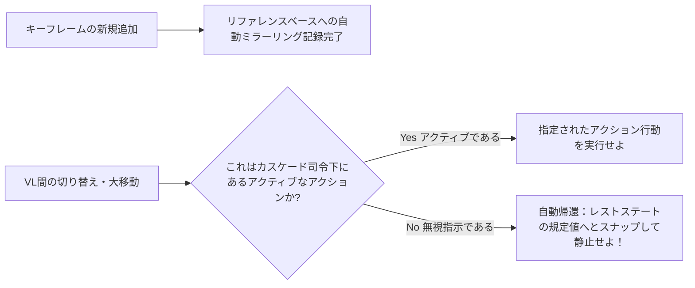

# レストステート (Rest State：基準化機能)

**レストステート (Rest State)** つまる所の "基準状態"システムは、あなたが各 View Layer ごとにバラバラに異なるアニメーション調整（アクション割り当て）を行った場合であったとしても、「汚染されていない、一番本来のベースのままのデフォルトのプロパティ値」を、自動的にかつ完全に保護・記録・保持し続ける機能です。

## コンセプト

それぞれの View Layer ごとにおいて、別々の（異なる独自の）アニメーションの対象としてオブジェクトの動きを操作した場合、それに付随して、元の素材本来の「ニュートラル・ベースライン ── 大黒柱たるデフォルトの初期位置、回転角、あるいはマテリアルの初期値」が絶対に必要になってきます。Rest State 機能システムは「これをユーザーに意識させず、完全自動で維持・運用」します。

## それがどのように働くのか (How It Works)

1. 全要素に対して共有されている **Reference Action (リファレンス用基準大アクション：内部名 `Reference_State`)** が、すべてのアニメーション（動的化）プロパティ群の「初期の基準デフォルト値」を、「フレーム 0」の座標記録として強固に保存・保管します。
2. これによって、あなたが・いつ・どの View Layer に居ようとキーフレームを新たに追加（Insert）し介入した瞬間に、Rest State システムは、介入されたそのプロパティの「一番最初の時点の現在のデフォルト値」を読み出し、それを上記の Reference Action (`Reference_State`) 用のアーカイブ・ベース内部へと **『完全自動で抽出・ミラーリング複製してバックアップ』** します。
3. これにより View Layer 間を切り替えた際、移動後の先のターゲットVLにおいて「なんのアニメーション指示設定も受けていない・対象から除外（非アクティブ化）された」オブジェクト達は、ただの置き物と化すのではなく、自動的に上記の大本ベースから呼び出され、**『自身の持っていた正しい基準値 (Rest State) にスナップしてピッタリと戻る (自動帰還・静止する)』** のです。

## 各種コントロール (Controls)

| コントロール | インターフェース場所 | 詳細と説明 |
|---------|----------|-------------|
| **Auto-Mirror (オートミラー化)** | ナビゲーションのヘッダー / または Globals (グローバル層)設定より | キーフレームを打った瞬間における「基準値の強制的自動復元ミラーリング」の オン/オフ 自体を切り替えます。 |
| **Set Reference Default (強制基準書き換え)** | 右クリックからの専用メニュー内 / または ++shift+alt+i++ / Takes ツリーでの利用 | 現在の「今の値」そのものを、新しい『強制的なRest State の基準値』として再規定・手動上書き設定します。 |
| **Revert to Rest (基準へスナップ即時復帰)** | ++alt+i++ / Takes ツリーでの利用 | 選択中のその当該プロパティを、記憶させてある大本 Rest State 側の絶対基準値へと「スナップさせて、即時・手動で引き戻して強制復帰」させます。 |

## システム対象・サポートされるデータブロック

堅牢な Rest State システム機能は、システムによるアニメーション操作が可能な「すべての標準データブロック」に対して余すところなくカバー介入します：

- Objects (物理的な移動トランスフォーム, 各表示非表示の切り替え)
- Lights (光源のエネルギー量, 色温度, 単純サイズ)
- Cameras (各種焦点距離設定, DOF/被写界深度等)
- Materials (中核となるシェーダープロパティの各種値)
- Worlds (大局の環境・各種ライト設定)
- Scenes (主組の重力値設定, アニメーション設定フレーム範囲など)
- Node Trees (あらゆるシェーダーノード組, コンポジターノードの設定)

!!! warning "サポート外：シェイプキー類 や ポーズボーン機構等"
    メッシュ形状自体を操作する「シェイプキーの各値」や、キャラクター等を動かす「ポーズボーン (Pose Bones) によるトランスフォーム介入値」は、
    現在、当面の Rest State システム側での包括的サポート対象外となっています。これらについては将来のリリースアップデートでの完全対応対応を計画しています。
