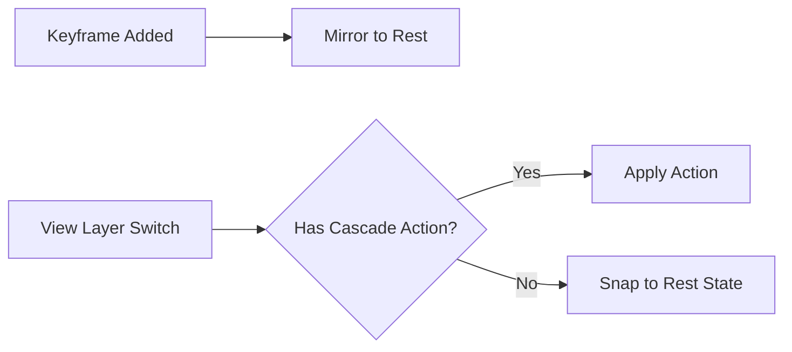

# Rest State

The **Rest State** system (formerly *Reference State*) automatically preserves pristine default property values alongside your per-View Layer animations.

## :material-lightbulb-outline: Concept

When you animate an object differently on each View Layer, you need a "neutral" baseline — the object's default position, rotation, material values, etc. The Rest State system maintains this baseline automatically.

## :material-cog-sync: How It Works

1. A shared **Rest Action** (`Rest_State`) stores the default values for all animated properties at frame 0.
2. When you add a keyframe on any View Layer, the Rest State system automatically mirrors that property's current default value into the Rest Action.
3. When switching View Layers, objects without animation on the target View Layer snap back to their Rest State values.

## :material-tune: Controls

| Control | Location | Description |
|---------|----------|-------------|
| **Auto-Mirror** | *Globals > Settings > Rest State*, or the Navigation header toggle. | Mirrors unkeyed property values into the Rest Action automatically. |
| **Rest Action picker** | *Globals > Settings > Rest State > Rest Action*. | Selects which Action stores the rest baseline. The **+** button creates a fresh one. |
| **Set Rest Default** | Property right-click menu → *Set Rest Default*. | Records the property's current value as its rest baseline. |

## :material-keyboard: Native Hotkeys

*Blender's standard keyframe shortcuts drive Rest State automatically — no addon-specific binding required.*

| Shortcut | Behavior |
|----------|----------|
| ++i++ (Insert Keyframe) | If **Auto-Mirror** is on, the unkeyed value is mirrored into the Rest Action **before** the keyframe is committed, preserving the rest baseline. |
| ++alt+i++ (Delete Keyframe) | After Blender removes the keyframe, the property snaps back to its Rest value automatically. |

## :material-database-check: Supported Datablocks

The Rest State system covers all standard animatable datablocks:

- Objects (transforms, visibility)
- Lights (energy, color, size)
- Cameras (focal length, DOF)
- Materials (shader properties)
- Worlds (environment settings)
- Scenes (gravity, frame range)
- Node Trees (shader nodes, compositor)
- Armatures (rest data — bone roll, layers)
- Shape Keys (per-key `value` and `slider_min` / `slider_max`)
- Curves, Lattices, Metaballs, Grease Pencil — wherever an animatable property has a meaningful rest value
