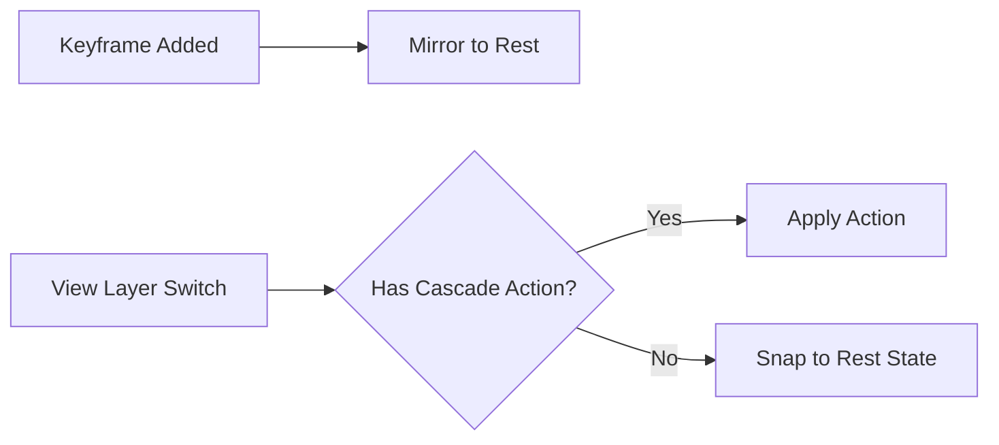

# Rest State

The **Rest State** system (formerly *Reference State*) automatically preserves pristine default property values alongside your per-View Layer animations.

## :material-lightbulb-outline: Concept

When you animate an object differently on each View Layer, you need a "neutral" baseline — the object's default position, rotation, material values, etc. The Rest State system maintains this baseline automatically.

## :material-cog-sync: How It Works

1. A shared **Rest Action** (`Rest_State`) stores the default values for all animated properties at frame 0.
2. When you add a keyframe on any View Layer, the Rest State system automatically mirrors that property's current default value into the Rest Action.
3. When switching View Layers, objects without animation on the target View Layer snap back to their Rest State values.

## :material-tune: Controls

| Control | Location | Description |
|---------|----------|-------------|
| **Auto-mirror keyframes** | *Globals > Settings > Rest State*. | Mirrors unkeyed property values into the Rest Action automatically. Persists as an addon preference (*Auto-mirror Keyframes to Rest* under *Preferences > Workflow > Automations > Rest State*). |
| **Rest Action picker** | *Globals > Settings > Rest State > Rest Action*. | Selects which Action stores the rest baseline. The **+** button creates a fresh one. |
| **{{ op('tks.set_rest_default').bl_label }}** | Property right-click menu → *{{ op('tks.set_rest_default').bl_label }}*. | Records the property's current value as its rest baseline — a keyframe at frame 0 in the Rest Action. Also appended to Blender's *Insert Keyframe* menu as **Keyframe to Rest**. |
| **{{ op('tks.rest_mode_toggle').bl_label }}** | Navigation header — the leftmost of the mode toggles (Rest State, then Still Mode, then [Value Lock](value_lock.md)). | **Rest State Mode:** every View Layer temporarily shows the rest baseline — compare it against your work or adjust the baseline in place, then click again to return. Tree assignments and renders always keep the real actions, and autokey pauses while the mode is on. Turning it on releases an active Value Lock (and vice versa) — the two take turns. |

## :material-dock-window: The Rest State Panel

Besides the inline block in *Globals > Settings*, Rest State has its own collapsible **{{ panel('TKS_PT_rest_state').bl_label }}** sub-panel on the Globals tab. Its header carries a ghost icon that fills in once a Rest Action is assigned, and the body holds the Rest Action picker plus the same tip box as the Settings block — the two locations read identically, so use whichever is closer to hand. (The Settings block additionally hosts the **+** new-action button and the **Auto-mirror keyframes** toggle.)

## :material-magnet: Manual Rest Tools

Auto-mirroring keeps the baseline current, but sometimes you want to push values *back* to it — or take a property out of Rest State's care entirely. These tools live in the **keyframe pie menu** (see [Pie Menus](pie_menus.md)).

### Snapping back to Rest

Reach for these when an object is stuck in a pose it inherited from another View Layer, or after experimenting without keyframes:

| Tool | Scope | What it does |
|------|-------|--------------|
| **Snap Active to Rest** (`tks.snap_prop_to_rest`) | One property | Snaps a single property back to its Rest State value. The pie slot greys out when the active object has nothing to snap back to (no slot in the Rest Action). |
| **{{ op('tks.snap_selected_to_rest').bl_label }}** (`tks.snap_selected_to_rest`) | Selected objects | Snaps every drifted property on the selected objects back to what the current mode expects — an unkeyed value returns to Rest State, a keyed value returns to its own frame-0 keyframe (or the rest pose while Rest State Mode is on). Driver-driven channels are left alone. |
| **{{ op('tks.snap_all_to_rest').bl_label }}** (`tks.snap_all_to_rest`) | Everything | Snaps *all* drifted properties back — same per-property rules as above, across every object. |

### Removing Rest keys

Reach for these when Rest State should stop managing a property or object — for example, an object whose neutral pose you now drive through the cascade instead:

| Tool | Scope | What it does |
|------|-------|--------------|
| **{{ op('tks.unset_rest_key_channel').bl_label }}** (`tks.unset_rest_key_channel`) | One channel | Deletes just that property's channel from the Rest Action, leaving the rest of the object's slot intact. Targets the hovered property, or the active object's transforms when run from the pie. |
| **{{ op('tks.unset_rest_slot').bl_label }}** (`tks.unset_rest_slot`) | Active object | Removes the active object's entire slot from the Rest Action, so it falls back to cascade-derived defaults instead of holding any rest values. |
| **{{ op('tks.clear_all_rest_keys_for_vl').bl_label }}** (`tks.clear_all_rest_keys_for_vl`) | View Layer | Walks every object visible in the active View Layer and removes each one's slot from the Rest Action. |
| **{{ op('tks.delete_rest_slot').bl_label }}** (`tks.delete_rest_slot`) | Active / Selected / All | Scope-aware slot removal — the pie offers *Active*, *· Sel* and *· All* variants. Destructive, so it asks for confirmation first (auto-accept toggle in Preferences). |

## :material-keyboard: Native Hotkeys

*Blender's standard keyframe shortcuts drive Rest State automatically — no addon-specific binding required.*

| Shortcut | Behavior |
|----------|----------|
| ++i++ (Insert Keyframe) | If **Auto-Mirror** is on, the unkeyed value is mirrored into the Rest Action **before** the keyframe is committed, preserving the rest baseline. |
| ++alt+i++ (Delete Keyframe) | After Blender removes the keyframe, the property snaps back to its Rest value — as long as **Auto-snap on Keyframe Clear** is enabled in [Preferences ▸ Workflow](../preferences/workflow.md). The snap fires once, on the deletion itself; the now-unkeyed value is then yours to move freely, and later edits stay where you put them. With the preference off, nothing snaps automatically — use the manual *Snap to Rest* tools. |

## :material-database-check: Supported Datablocks

The Rest State system covers all standard animatable datablocks:

- Objects (transforms, visibility)
- Lights (energy, color, size)
- Cameras (focal length, DOF)
- Materials (shader properties)
- Worlds (environment settings)
- Scenes (gravity, frame range)
- Node Trees (shader nodes, compositor)
- Armatures (rest data — bone roll, layers)
- Shape Keys (per-key `value` and `slider_min` / `slider_max`)
- Curves, Lattices, Metaballs, Grease Pencil — wherever an animatable property has a meaningful rest value
