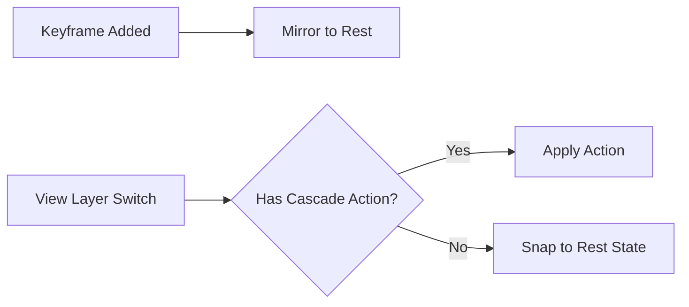

# Rest State

The **Rest Action** is your neutral baseline. Every property you have *not* keyed falls back to it.

Those baseline values live at frame 0. Takes keeps them safe while you animate each View Layer differently.

## :material-cog-sync: How It Works

Key a property, and its old unkeyed value is copied into the Rest Action first.

Switch View Layers, and anything with no animation there snaps back to that baseline.

```mermaid
graph LR
    K[Keyframe Added] --> M[Mirror to Rest]
    Switch[View Layer Switch] --> C{Has Cascade Action?}
    C -->|Yes| A[Apply Action]
    C -->|No| R[Snap to Rest State]
```

??? note "Blender's own keyframe shortcuts already drive this"
    | Shortcut | What happens |
    |---|---|
    | ++i++ | With **Auto-mirror keyframes** on, the unkeyed value goes to the Rest Action *before* the keyframe is written. |
    | ++alt+i++ | The property snaps back to its rest value, if **Auto-snap on Keyframe Clear** is on in [Preferences ▸ Workflow](../preferences/workflow.md). |

    No add-on shortcut is needed. The ++alt+i++ snap fires once, on the deletion
    itself. After that the value is yours to move freely, and later edits stay
    where you put them. With the preference off nothing snaps — use the manual
    tools below.

??? info "Which data has a rest value"
    Objects (transforms, visibility), lights (energy, colour, size), cameras (focal
    length, depth of field), materials and node trees (shader and compositor values),
    worlds (environment settings), scenes (gravity, frame range), armatures (bone roll
    and layers) and shape keys (each key's value and its slider range).

    Curves, lattices, metaballs and Grease Pencil are covered too — anywhere an
    animatable property has a meaningful neutral value.

    Rest State was called *Reference State* in older versions.

## :material-tune: Controls

The Rest State block sits in *Globals ▸ Settings*.

| Control | What it does |
|---|---|
| **Rest Action** | Picks which action holds your baseline. **+** makes a fresh one. |
| **Auto-mirror keyframes** | Copies an unkeyed value into the Rest Action as you key it. |
| **{{ op('tks.set_rest_default').bl_label }}** | Records the property's current value as its baseline. |
| **{{ op('tks.rest_mode_toggle').bl_label }}** | Shows the baseline on every View Layer until you click it again. |

??? info "The fine print on these four"
    **Auto-mirror keyframes** is also an add-on preference, *Auto-mirror Keyframes
    to Rest*, under *Preferences ▸ Workflow ▸ Automations ▸ Rest State*.

    **{{ op('tks.set_rest_default').bl_label }}** sits in the right-click menu of any
    property, and in Blender's *Insert Keyframe* menu as **Keyframe to Rest**. It
    writes a keyframe at frame 0 in the Rest Action.

    **{{ op('tks.rest_mode_toggle').bl_label }}** is the leftmost of the three mode
    toggles in the Navigation header, before **Still Mode** and
    [Value Lock](value_lock.md). Use it to compare your work against the baseline,
    or to adjust the baseline in place. Tree assignments and renders always use the
    real actions, and autokey pauses while the mode is on. Turning it on releases an
    active Value Lock, and the other way round.

## :material-dock-window: The Rest State Panel

The Globals tab also carries a foldable **{{ panel('TKS_PT_rest_state').bl_label }}** panel. Its ghost icon fills in once a Rest Action is assigned.

It shows the same Rest Action picker and tip as the Settings block, so use whichever is closer to hand. Only the Settings block adds the **+** button and the **Auto-mirror keyframes** toggle.

## :material-magnet: Manual Rest Tools

Auto-mirroring keeps the baseline current. These tools push values back to it, or hand a property back to you.

They all live in the **keyframe pie menu** — see [Pie Menus](pie_menus.md).

### Snapping back to Rest

Reach for these when an object is stuck in a pose it picked up from another View Layer.

| Tool | Scope |
|---|---|
| **Snap Active to Rest** | One property |
| **{{ op('tks.snap_selected_to_rest').bl_label }}** | The selected objects |
| **{{ op('tks.snap_all_to_rest').bl_label }}** | Everything |

??? info "What exactly snaps where"
    An unkeyed property returns to its rest value. A keyed one returns to its own
    frame-0 keyframe — or to the rest pose while **Rest State Mode** is on. Anything
    driven by a driver is left alone.

    **Snap Active to Rest** greys out in the pie when the active object has nothing
    stored in the Rest Action.

### Unsaved moves

Reach for these when the drift warning lists **Unsaved Moves** - values you changed on a keyed property that Blender drops on the next frame change.

| Tool | What it does |
|---|---|
| **Keep** (row button) | Keys that one value on the object's own action |
| **Keep All** | Keys every listed value at once |
| **Let All Go** | Snaps every listed value back to its keyed value |

??? info "Why a move can be unsaved"
    A keyed property shows the value you dragged only until the next
    animation update. The warning catches it before that, so you decide:
    keep it as a keyframe, or let it go.

### Removing Rest keys

Reach for these when Rest State should stop looking after a property or an object.

| Tool | Removes |
|---|---|
| **{{ op('tks.unset_rest_key_channel').bl_label }}** | One property's channel |
| **{{ op('tks.unset_rest_slot').bl_label }}** | The active object's whole rest slot |
| **{{ op('tks.clear_all_rest_keys_for_vl').bl_label }}** | Every object in the active View Layer |
| **{{ op('tks.delete_rest_slot').bl_label }}** | Active, selected, or all objects |

??? info "Details and safety net"
    **{{ op('tks.unset_rest_key_channel').bl_label }}** targets the property you hover,
    or the active object's transforms when you run it from the pie. The rest of that
    object's rest slot stays.

    An object with no rest slot left falls back to the defaults it gets from the
    [cascade](cascade.md) — handy when you now drive its neutral pose there instead.

    **{{ op('tks.delete_rest_slot').bl_label }}** offers *Active*, *· Sel* and *· All*
    in the pie. It is destructive, so it asks you to confirm first. You can
    auto-accept that in Preferences.
