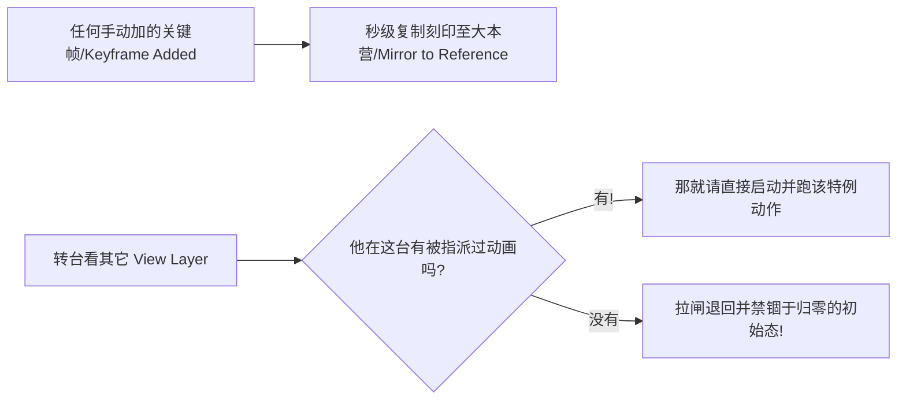

# 基准备用重定义形态层 (Rest State)

系统体系里的又一巨头 **Rest State (原始初始参照/参考层状态)** 是专精于防飞线丢失的数据硬锁固层! 它的原理使命在于能纯自动，且滴水不漏地将最为出场时刻洁净的各大基础数值进行备案和复苏、从而保证不会因为你在某特定 View-Layer 单独随意乱造各种高危动画之举而酿成灾难！

## 基本解构逻辑 (Concept)

假设一种场合：你需要某个主角瓶子模型在这个单独 View Layer 特效里疯狂大旋风转乱摆。但你要保证人家回归平常或者串台到了其余镜头场合的时候它理所也必须应当表现的一身文静待在那里原模原样的标准最初之位不是吗！ 这便是极重要的还原归零基准位！这一整块"中性绝对归零基准位（neutral baseline）"，无论是包含摆位(Rotation)、地理数据(Position)甚至是皮表材质变动情况，我们强大的"基准定序体(Rest State system)"在它身后面帮你统统维持了不被打乱的绝佳护航机制！

## 底边核心自动操作逻辑解说 (How It Works)

1. 由后台系统主动去代劳去构建出一个叫 **Reference Action** (档案名:`Reference_State`) 这独一份的核心动画档案记录，专门定点锁死和打卡所有的默认归零属性在绝对原点(第0号首帧位/Frame 0)上!
2. 若你在任意的 View Layer 底下大开杀戒地加上某关键动画标记时，那时刻本套 Rest State 系统必然会以最速时间光速对向、去自动帮你镜像出它在此变动这秒，相较下最自然状态的未篡改原始归零坐标和各种未异变之基准标位镜像（mirror）数据抄记在刚刚那本原初小册子 (Reference Action)！
3. 当你抽刀断水切台跳转其它 View Layer 去巡览。若发现该处本就不赋存什么动画的话，那么这受管制下的被操作模型就会极其自然地按照规矩 "乖乖吸附回归" 退回那本原归零法案给它们套死的一身静止态、呆瓜式本分表现 (Rest State values)上停留了去！

## 面板上的小操纵手柄 (Controls)

| 用作 | 身处啥位置 | 详细用途简述 |
|---------|----------|-------------|
| **Auto-Mirror (全自动化镜像)** | 导航栏头/也可进Globals查找 | 全局控制自动捕抓关键插入并同时记录基准态的功能开关。 |
| **Set Reference Default (设为初始参考)** | 唤出对象的快捷单 / 抑或按快键 ++shift+alt+i++ | 手工操作：硬性把目前造型和属性定为将来的参照基准版 "归零态(Rest State)" 。 |
| **Revert to Rest (一键归零还原)** | 快捷键 ++alt+i++ | 强行撤回：让属性立刻回拉恢复成它本应该在初始记录本上的清白模样(Rest State value)。 |

## 目前受管制约束的组件 (Supported Datablocks)

当前大系统下的 Rest State 足以支撑及管制当今任何支持动画的关键组成体:

- 万物皆对象模型物体 (位移变形体系Transforms, 及消失显现Visibility)
- 各种灯光光体 (强度Energy, 颜色Color, 尺寸大小)
- 相机设备 (光学焦距, 甚至景深 DOF)
- 材料库 (凡涉及渲染管线的着色节点等等)
- 世界环境 (一切牵扯其环境有关的节点设置)
- 大场景舞台 (引力数据, 时长快慢帧段修改)
- 节点网络 (图形节点排布及直到最终期合成系统器！)

!!! warning "尚待完全支持降伏的分类: 形变骨架节点 (Shape Keys & Pose Bones)"
    目前进度时限下！各种用于软伸拉挤压控制颜面的 (Shape Keys 值域系统) 跟任何包含骨骼去驱动动作数据的网络体系 (pose bone transforms) 统统尚未受支持! 不在咱们这个强大的体系神圣管束 (Rest State system) 内! 但此项功能计划必定会在后续小补丁更新中被实装加入!
