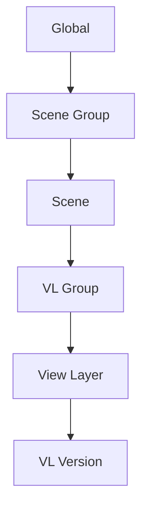

# Erste Schritte

Diese Anleitung führt Sie in weniger als 5 Minuten durch den grundlegenden Arbeitsablauf.

## Grundlagen verstehen

Takes for Blender organisiert Ihre Szene in einer Hierarchie:

Jede Ebene in dieser Hierarchie kann Eigenschaften der darüberliegenden Ebene überschreiben – dies ist das **Cascade**-System.

## Ihr erster Take

### 1. Öffnen Sie das Takes-Panel

Drücken Sie im 3D-Viewport **++n++**, um die Seitenleiste zu öffnen, und klicken Sie dann auf die Registerkarte **Takes**.

Der **Takes-Baum** zeigt alle Ihre aktuellen Szenen und View-Layer in einer einheitlichen Liste an.

### 2. Eine Ansichtsebene hinzufügen

1. Klicken Sie auf die Schaltfläche **+** in der Seitenleiste des Baums.
2. Wählen Sie **Ansichtsebene hinzufügen**.
3. Die neue Ansichtsebene erscheint im Baum und wird aktiv.

### 3. Eine Kamera zuweisen

Jede Ansichtsebene kann eine eigene Kamera haben:

1. Wählen Sie Ihre neue Ansichtsebene im Baum aus.
2. Klicken Sie auf das **Kamerasymbol** (:material-camera:) in der Zeile der Ansichtsebene.
3. Wählen Sie im Popover eine Kamera aus der Dropdown-Liste aus.

### 4. Mit Gruppen organisieren

Gruppieren Sie verwandte Ansichtsebenen:

1. Wählen Sie eine Ansichtsebene in der Baumstruktur aus.
2. Drücken Sie ++Strg+G++, um eine VL-Gruppe zu erstellen.
3. Ziehe andere Ansichtsebenen in die Gruppe.

### 5. Stapelrendering

Rendere alle deine Ansichtsebenen auf einmal:

1. Klicke auf die Schaltfläche **Render** (:material-image:) in der Seitenleiste der Baumstruktur.
2. Der Stapelrenderer verarbeitet jede Ansichtsebene mit ihren Kaskaden-Überschreibungen.
3. Ausgabedateien werden automatisch mithilfe des Smart-Output-Token-Systems benannt.

## Was kommt als Nächstes?

- Informieren Sie sich über das [Kaskadensystem](../features/cascade.md), um zu verstehen, wie Überschreibungen funktionieren
- Richten Sie [Render-Voreinstellungen](../features/render_presets.md) für einheitliche Ausgabeeinstellungen ein
- Entdecken Sie den [Varianten-Schalter](../features/variant_switch.md) für Materialvariationen
