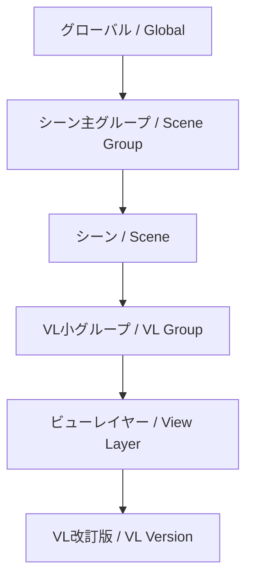

# はじめの一歩 (First Steps)

このガイドでは、5分以内に中心となるコアワークフローを順を追って説明します。

## 基本構造を理解する

Takes for Blender は、シーンを大きな一つの階層へと整理します：

この階層内の各レベルは、ひとつ上のレベルからのプロパティをオーバーライド (上書き) することができます。この強力な権限管理こそが **カスケード (Cascade)** システムなのです。

## あなたの最初の Take (テイク)

### 1. Takes パネルを開く

3D ビューポート内で ++n++ キーを押してサイドバーを開き、**Takes** タブをクリックします。

**Takes Tree (Takes ツリー)** には、現在のすべてのシーンとビューレイヤーが統合されたリストとして表示されます。

### 2. View Layer (ビューレイヤー) の追加

1. ツリーサイドバー内にある **+** ボタンをクリックします。
2. **Add View Layer (ビューレイヤーの追加)** を選択します。
3. ツリーに新しい View Layer が出現し、直ちにアクティブになります。

### 3. カメラ (Camera) の割り当て

それぞれの View Layer には独立したカメラを持たせることができます：

1. ツリーで作成したばかりの新しい View Layer を選択します。
2. その View Layer の列にある **カメラアイコン** (:material-camera:) をクリックします。
3. ポップオーバーメニューから、ドロップダウンリストを使って割り当てたいカメラを選択します。

### 4. グループ (Groups) での整理

関連する複数の View Layer を一緒にグループ化します：

1. ツリー内で任意の View Layer を選択します。
2. ++ctrl+g++ を押して VL Group を作成します。
3. 他の View Layer をそのグループ内へとドラッグして移します。

### 5. バッチレンダリング (Batch Render) 

すべての View Layer を一度にすべてレンダリングします：

1. ツリーサイドバーにある **Render (レンダリング)** ボタン (:material-image:) をクリックします。
2. バッチレンダラーは、設定された各 View Layer を、それぞれのカスケードによって上書きされた固有の設定に基づいて処理します。
3. 出力ファイルは、Smart Output (スマート出力) のトークンシステムを使用して、完全に自動的に名付けられて出力されます。

## 次のステップ

- カスケードの上書き権限がどのように流れるかを理解するために、[カスケードシステム (Cascade System)](../features/cascade.md) について学びましょう
- 一貫した出力設定を行うために、[レンダープリセット (Render Presets)](../features/render_presets.md) を設定しましょう
- 多彩な素材バリエーション切り替えのための [バリアントスイッチ (Variant Switch)](../features/variant_switch.md) を探索してみましょう
