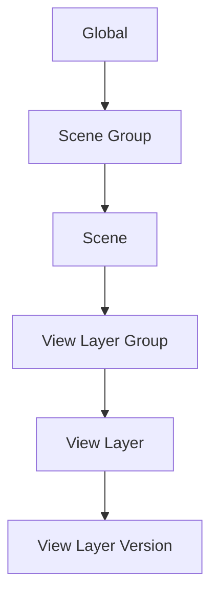

# First Steps

This guide walks you through the core workflow in under 5 minutes.

## :material-lightbulb-outline: Understanding the Basics

Takes for Blender organizes your scene into a hierarchy:

Each level in this hierarchy can override properties from the level above — this is the **Cascade** system.

## :material-movie-open-plus: Your First Take

### :material-numeric-1-circle: 1. Open the Takes Panel
Press ++n++ in the 3D Viewport to open the sidebar, then click the **Takes** tab.

The **Takes Tree** shows all your current scenes and view layers in a unified list.

### :material-numeric-2-circle: 2. Add a View Layer
1. Click the **+** button in the tree sidebar.
2. Select **Add View Layer**.
3. The new View Layer appears in the tree and becomes active.

### :material-numeric-3-circle: 3. Assign a Camera
Each View Layer can have its own camera:

1. Select your new View Layer in the tree.
2. Click the **camera icon** (:material-camera:) on the View Layer row.
3. In the popover, choose a camera from the dropdown.

### :material-numeric-4-circle: 4. Organize with Groups
Group related View Layers together:

1. Select a View Layer in the tree.
2. Press ++ctrl+g++ to create a View Layer Group.
3. Drag other View Layers into the group.

### :material-numeric-5-circle: 5. Batch Render
Render all your View Layers at once:

1. Click the **Render** button (:material-image:) in the tree sidebar.
2. The batch renderer processes each View Layer with its cascade overrides.
3. Output files are named automatically using the Smart Output token system.

## :material-arrow-right-circle: What's Next?

- Learn about the [Cascade System](../features/cascade.md) to understand how overrides flow
- Set up [Render Presets](../features/render_presets.md) for consistent output settings
- Explore [Variant Switch](../features/variant_switch.md) for material variations
