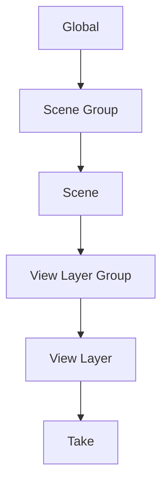

# The Six Levels

Takes sorts your file into six levels. Each one can carry its own camera, world, action and render settings.

A deeper level always beats a wider one. That is the whole idea.

```mermaid
graph TD
    Global[Global] --> SceneGrp[Scene Group]
    SceneGrp --> Scene[Scene]
    Scene --> LayerGroup[View Layer Group]
    LayerGroup --> Layer[View Layer]
    Layer --> Take[Take]
```

## :material-format-list-bulleted: What each level is for

| Level | What it holds | Example |
|---|---|---|
| **Global** | Your project defaults | The camera every shot starts with |
| **Scene Group** | A folder of scenes | "Interior", "Exterior" |
| **Scene** | One Blender scene | "Kitchen" |
| **View Layer Group** | A folder of shots | "Hero Shots" |
| **View Layer** | One shot — this is what renders | "Front 3/4" |
| **Take** | One saved round of that shot | "Take 2 · Night Lighting" |

You set **Global** in the [Globals](../features/globals.md) panel. The other five live in the Takes Tree.

## :material-stairs: Deeper wins

Give a scene a world, and every shot in that scene uses it.

Give one shot its own world, and that shot wins. The rest still follow the scene.

That is the [Cascade](../features/cascade.md). A **bright** icon on a tree row means the value is set there. A **dimmed** icon means it came from above.

## :material-help-circle-outline: A new shot, or another round?

Add a **View Layer** when the shot itself changes: other objects, other passes, other motion.

Add a **Take** when you are having another go at the same shot, after a review.

??? info "An example"
    "Bottle, front angle" is a View Layer.

    "Take 1 · first pass" and "Take 2 · warmer light" are two takes of it. Both
    render the same objects from the same angle. Only the lighting differs.

## :material-arrow-right-circle: Next

Build one: [Your First Take](first_take.md).
