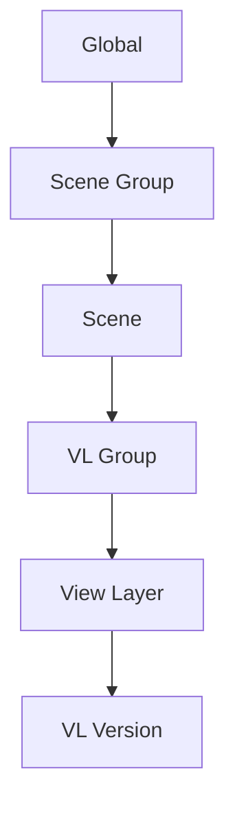

# Первые шаги

Это руководство проведет вас через основной рабочий процесс менее чем за 5 минут.

## Понимание основ

Takes for Blender организует вашу сцену в виде иерархии:

Каждый уровень в этой иерархии может переопределять (override) свойства уровня выше — это система **Каскада (Cascade)**.

## Ваш первый Take

### 1. Откройте панель Takes

Нажмите ++n++ во вьюпорте (3D Viewport), чтобы открыть боковую панель, затем щелкните по вкладке **Takes**.

Дерево **Takes Tree** показывает все ваши текущие сцены и слои (view layers) в едином списке.

### 2. Добавьте View Layer

1. Нажмите кнопку **+** на боковой панели дерева.
2. Выберите **Add View Layer**.
3. Новый View Layer появится в дереве и станет активным.

### 3. Назначьте камеру

Каждый View Layer может иметь свою собственную камеру:

1. Выберите ваш новый View Layer в дереве.
2. Щелкните значок **камеры** (:material-camera:) в строке View Layer.
3. В появившемся окне выберите камеру из выпадающего списка.

### 4. Организация с помощью групп

Группируйте связанные View Layers вместе:

1. Выберите View Layer в дереве.
2. Нажмите ++ctrl+g++, чтобы создать группу VL Group.
3. Перетащите другие View Layers в эту группу.

### 5. Пакетный рендеринг (Batch Render)

Рендеринг всех ваших View Layers за один раз:

1. Нажмите кнопку **Render** (:material-image:) на боковой панели дерева.
2. Пакетный рендер обрабатывает каждый View Layer с его переопределениями каскада.
3. Выходные файлы именуются автоматически с использованием системы тегов Smart Output.

## Что дальше?

- Изучите [Систему Каскада (Cascade System)](../features/cascade.md), чтобы понять, как работают переопределения
- Настройте [Пресеты рендера (Render Presets)](../features/render_presets.md) для согласованных настроек вывода
- Изучите [Переключатель вариантов (Variant Switch)](../features/variant_switch.md) для вариаций материалов
