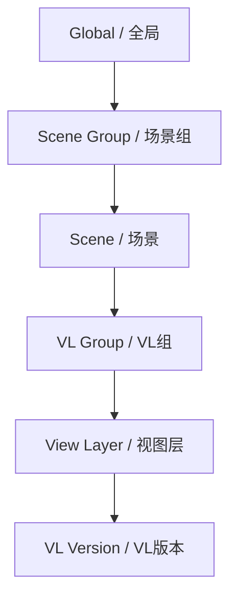

# 第一步

本指南将带领你在5分钟内掌握核心工作流。

## 了解基础

Takes for Blender 会将你的场景归纳为一个树状层级结构：

这套层级中的每一层，都可以覆盖 (override) 来自上一层的属性 —— 这就是所谓的 **Cascade (级联)** 系统。

## 你的第一个 Take

### 1. 打开 Takes 面板

在 3D 视图中按 ++n++ 打开侧边栏，然后点击 **Takes** 选项卡。

**Takes Tree (树状图)** 会在一个统一的列表中显示当前所有的场景及视图层 (view layers)。

### 2. 添加视图层 (View Layer)

1. 点击侧边栏树状图右侧的 **+** 号按钮。
2. 选择 **Add View Layer（添加视图层）**。
3. 新的视图层将出现在树中并成为活跃层。

### 3. 分配相机

每一个 View Layer 都能拥有属于自己的专属相机：

1. 在树中选中你刚刚新建的 View Layer。
2. 点击当前 View Layer 行上的 **相机图标** (:material-camera:)。
3. 在弹出的菜单中，从下拉列表中选择一个相机。

### 4. 使用分组进行整理

将相关的 View Layers 整理在同一组内：

1. 选中树中的某个 View Layer。
2. 按 ++ctrl+g++ 创建一个 VL Group。
3. 将其它 View Layers 拖拽到该组中。

### 5. 批量渲染 (Batch Render)

一次性渲染你所有的 View Layers：

1. 点击树侧边栏的 **Render (渲染)** 按钮 (:material-image:)。
2. 批量渲染器将逐个处理每一层 View Layer 及其挂载的级联覆盖配置。
3. 生成的输出文件将自动依照智能输出 (Smart Output) 令牌系统来命名。

## 接下来看什么？

- 阅读 [Cascade System (级联系统)](../features/cascade.md) 以了解属性覆盖逻辑是如何传递的
- 设定 [Render Presets (渲染预设)](../features/render_presets.md) 来保障一致的输出配置
- 探索 [Variant Switch (变体切换)](../features/variant_switch.md) 以尝试切换不同的材质变体
