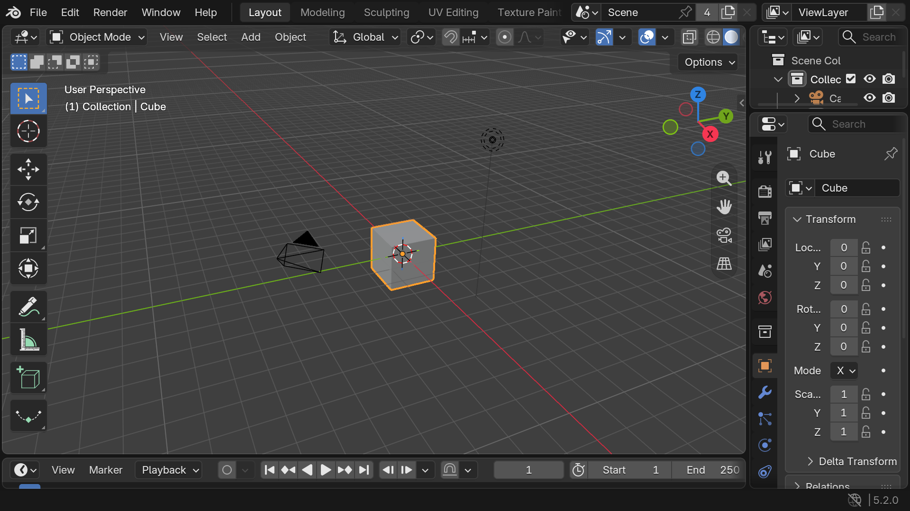
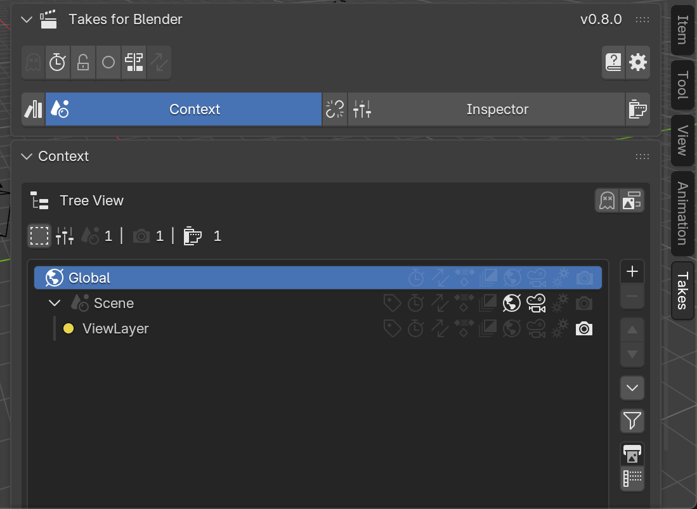
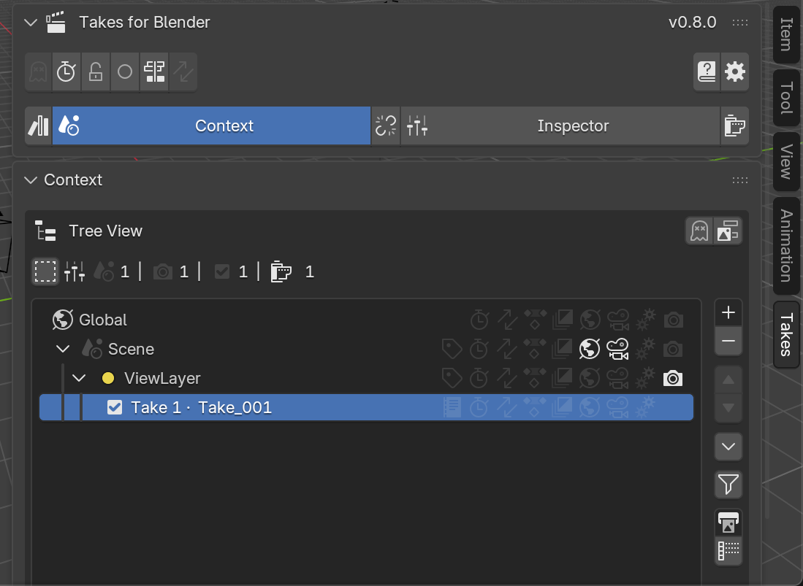
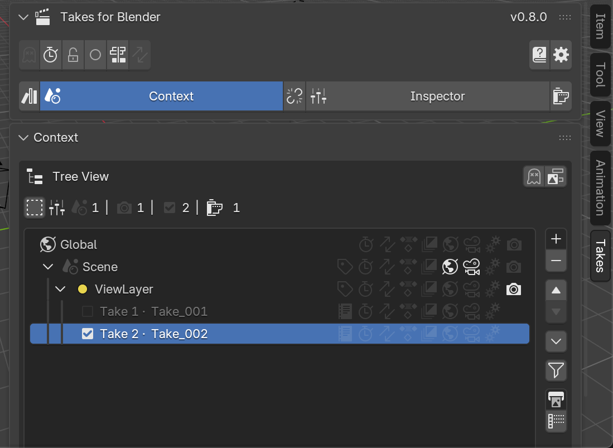
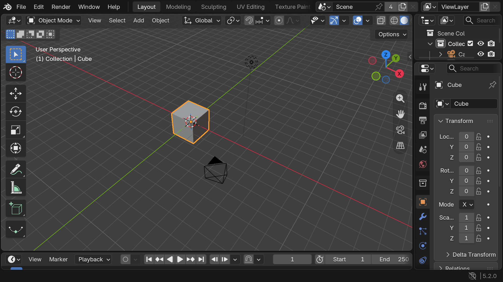

# Your First Take

In this lesson you build one shot with two takes and flip between two camera angles. It takes about 10 minutes.

New to the panel? Skim [First Steps](first_steps.md) first.

## 1. Open a fresh file

In Blender, choose **File → New → General**. You get the default cube, camera and light.

## 2. Open the Takes tab

Press ++n++ in the 3D Viewport and click the **Takes** tab. The tree shows your scene and its View Layer.

## 3. Add your first take

Click the **ViewLayer** row, then the **+** button beside the tree. **Take_001** appears under the layer, already live.

## 4. Give it the default camera

Click the camera icon on the take's row and pick **Camera** from the menu.

camera menu on the take row, Camera entry

## 5. Add a second take

Click **+** again. **Take_002** appears and is now the live take.

## 6. Frame a new angle

Orbit the viewport with the middle mouse button until you see the cube from a different side.

## 7. Create a camera for this angle

Click the camera icon on the **ViewLayer** row and choose **Create New Camera**. The view snaps into the new camera — **Take_002** has no camera of its own, so it uses the layer's.

Create New Camera entry in the layer's camera menu

## 8. Flip between your takes

Click **Take_001** — the viewport jumps to the first framing. Click **Take_002** — back to the new one.

side-by-side of the two framings while flipping takes

## Done

You made one shot with two takes, each showing its own angle. Next: [Switch Between Takes](../workflows/switch_takes.md) — it also shows **{{ op('tks.new_take_from_here').bl_label }}**, which starts your next round as a full copy.
