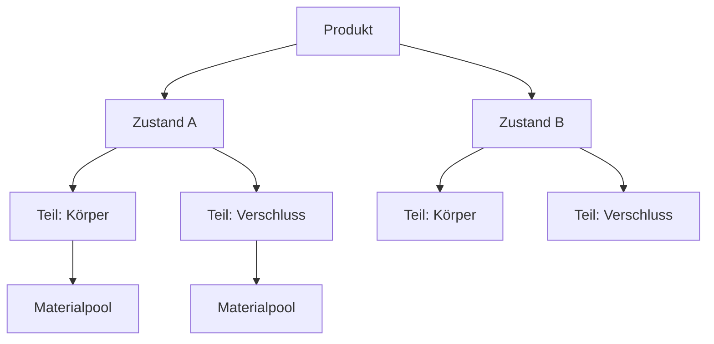

# Variantenbaum

**Speicherort:** *Eigenschaften-Editor > Registerkarte „Takes“ > Variantenumschalter*

Der Variantenbaum verwaltet Produktvarianten – verschiedene Materialkonfigurationen, Farboptionen oder Zustände Ihres Produkts. Er nutzt eine hierarchische Struktur aus Produkten, Zuständen und Teilen.

## Hierarchie

Produkt
:   Der Container der obersten Ebene (z. B. „Flasche“, „Uhr“).

Zustand
:   Eine benannte Variante des Produkts (z. B. „Gold“, „Silber“, „Mattschwarz“).

Teil
:   Eine Komponente des Produkts, die mit einer Kollektion verknüpft ist (z. B. „Körper“, „Verschluss“, „Armband“).
    Jedes Teil verfügt über einen Materialpool mit indizierten Slots.

## Verwendung

### Varianten wechseln

Klicken Sie auf das **Rauten-Symbol** eines beliebigen inaktiven Zustands, um sofort eine Vorschau dieser Variante im Ansichtsfenster anzuzeigen. Der aktive Zustand wird als ausgefüllter Kreis dargestellt.

### Materialpool

Jedes Teil verfügt über einen Materialpool – eine Liste von Materialien, die ausgetauscht werden können:

1. Weisen Sie dem ersten leeren Slot ein Material zu (ein neuer Slot wird automatisch erstellt).
2. Verwenden Sie den **Pool-Index**, um auszuwählen, welches Material für dieses Teil aktiv ist.
3. Beim Wechseln der Zustände tauscht das System die Materialien entsprechend dem Pool-Index des jeweiligen Zustands aus.

### Zuweisung zu einer Sammlung

Jedes Teil ist mit einer Blender-Sammlung verknüpft. Alle Objekte in dieser Sammlung (und den untergeordneten Sammlungen) erhalten den Materialwechsel.

## Varianten-Tags

Zustände können mit der Tag-Kategorie **Variant** versehen werden, um sie zu organisieren und die Auflösung von Smart-Output-Tokens über `{variant_tag}` zu ermöglichen.
