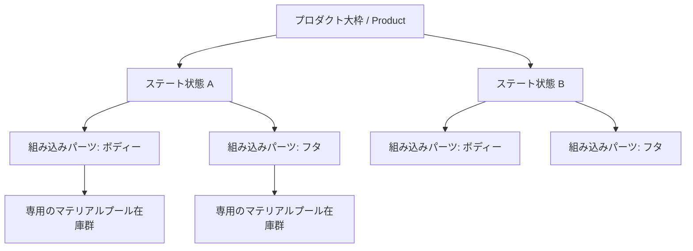

# バリアントツリー (Variant Tree)

**場所:** *Properties Editor (プロパティエディター) > Takes タブ > Variant Switch (バリアントスイッチ切り替え先)*

バリアントツリーは、製品の「バリアント (異なる素材構成、カラーオプション、あるいは製品ごとの特殊な形状状態)」そのものを管理します。プロダクト (Product) 、ステート (State)、パーツ (Part) といった階層構造を使用して、この複雑な構成の全容を制御します。

## 仕様階層のアウトライン (Hierarchy)

プロダクト (Product)
:   すべてをひっくるめた最上位のコンテナとなる大枠 (例：「ステンレスボトル全体」、「腕時計全モデル」など)。

ステート (State)
:   ユーザーが任意に名付けた「製品全体の組み合わせ状態名（派生名）」 (例：「通常ゴールド版」、「チタンシルバー版」、「マットブラック限定色」など)。

パーツ (Part)
:   Blender 内部のコレクション (Collection) と直接リンクされている「製品個々の部品」コンポーネント (例：「ボディー筒」、「フタ部分」、「革製ストラップ」など)。
    さらに、各パーツ自体に専用の「マテリアルプール (在庫群)」が付属しており、内部にインデックス化（番号化）されたスロットを持っています。

## 使用方法 (Usage)

### バリアント (配色や部材状態) を切り替えるには

非アクティブなステート（State）に配置されている **ひし形アイコン (diamond icon)** を一つクリックしてください。それだけで、その仕様のバリアント構成が直ちにビューポート上で適用されプレビューできます。この際、現在アクティブになっている（実際に権限を得ている）ステートは、中身が塗りつぶされた黒い完全な円形で表示されます。

### マテリアルプール (Material Pool)

各パーツとなる部品（Part）は、自身専用の「マテリアルプール」と呼ばれる一覧リストを持っています。ここにはいつでも瞬時に交換できるマテリアルストックを並べることができます：

1. 最初の「空」のスロットにお好みのマテリアルを割り当てます (スロットを埋めると同時に、さらに新しい空枠スロットが自動的に真下に作られます)。
2. 番号付けされた **プールインデックス (pool index)** 指定を使用して、そのパーツ・部品に対して何番のマテリアルを適用するのかを決定します。
3. これらを揃えたのちに、ステートの切り替え操作を行えば、各ステートに記憶させた「指定したプールインデックス番号」設定に従って、システムが全マテリアルを総取り替えします。

### コレクションへの割り当てリンク (Collection Assignment)

登録されたそれぞれのパーツ (Part) 本体は、Blender のどれか一つのコレクションへと紐付け (リンク) されています。結果として、指定されたそのコレクション（および子コレクション）内に存在する「すべてのオブジェクト」が、このマテリアルの一斉スワップ (置換) システムの恩恵を受けます。

## バリアント用タグの設定 (Variant Tags)

各ステート（状態名）に関しては、**Variant (バリアント)** カテゴリーからタグ付け割り当てを行うことができます。これにより、プロジェクト内を強力に整理整頓できるだけでなく、Smart Output (スマート出力) 上で用いる `{variant_tag}` トークン解決を利用してファイル名自動出力をコントロールできます。
