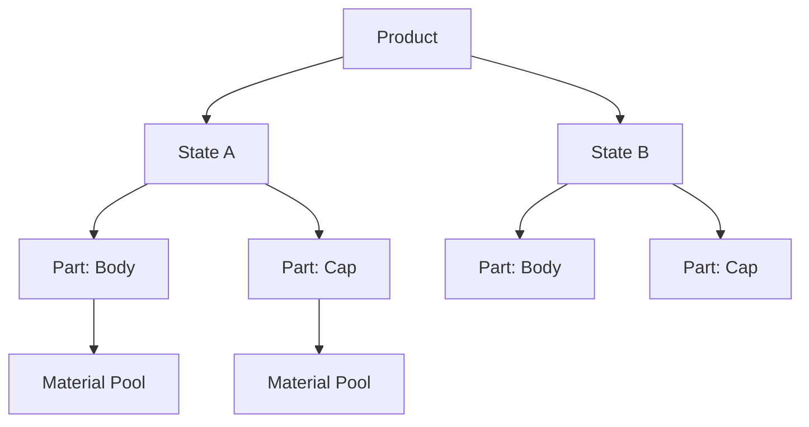

# Variant Tree

**Location:** *3D Viewport > Sidebar (++n++) > Takes tab > [Globals](../features/globals.md) > **Variants** mode*.

The Variant Tree manages product variants — different material configurations, color options, or states of your product. It uses a hierarchical structure of Products, States, and Parts. The tree is one of five modes inside the Globals panel; switch to it via the Globals header's **Variants** mode button.

## :material-source-branch: Hierarchy

Product
:   The top-level container (e.g., "Bottle", "Watch").

State
:   A named variant of the product (e.g., "Gold", "Silver", "Matte Black").

Part
:   A component of the product linked to a collection (e.g., "Body", "Cap", "Strap").
    Each part has a material pool with indexed slots.

## :material-cursor-default-click: Usage

### :material-swap-horizontal: Switching Variants
Click the **diamond icon** on any inactive state to immediately preview that variant in the viewport. The active state shows as a filled circle.

### :material-palette: Material Pool
Each Part has a material pool — a list of materials that can be swapped in:

1. Assign a material to the first empty slot (a new slot auto-creates).
2. Use the **pool index** to select which material is active for that part.
3. When switching states, the system swaps materials according to each state's pool index.

### :material-folder-multiple: Collection Assignment
Each Part is linked to a Blender collection. All objects in that collection (and child collections) receive the material swap.

## :material-tag: Variant Tags

States can be tagged with the **Variant** tag category for organization and Smart Output token resolution via `{variant_tag}`.

## :material-keyboard: Hotkeys

| Shortcut | Action |
|----------|--------|
| ++ctrl+n++ | Smart add (Product, State, or Part depending on selection). |
| ++shift+a++ | Full add menu. |
| ++f2++ | Rename the selected Product / State / Part. |
| ++del++ / ++x++ | Remove the selected item (enforces minimum 1 State and 1 Part per Product). |
| ++ctrl+i++ | Invert multi-selection. |
| ++alt++ + click on a cascade icon | Clear the variant override at this tier. |

See the full reference at [Keyboard Shortcuts](hotkeys.md).
