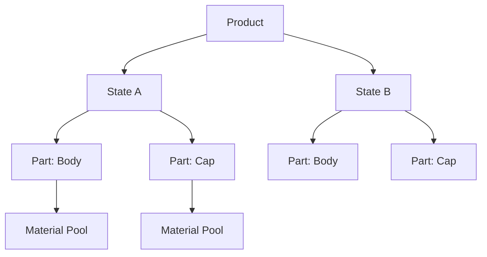

# Variant Tree

**Location:** *3D Viewport > Sidebar (++n++) > Takes tab > [Globals](../features/globals.md) > **Variants** mode*.

The Variant Tree manages product variants — colour options, finishes or states of one product.

It is one of five modes in the Globals panel. Switch to it with the header's **Variants** button.

## :material-source-branch: Hierarchy

```mermaid
graph TD
    P[Product] --> S1[State A]
    P --> S2[State B]
    S1 --> PA[Part: Body]
    S1 --> PB[Part: Cap]
    S2 --> PC[Part: Body]
    S2 --> PD[Part: Cap]
    PA --> M1[Material Pool]
    PB --> M2[Material Pool]
```

Product
:   The top-level container ("Bottle", "Watch").

State
:   A named variant of the product ("Gold", "Matte Black").

Part
:   A component linked to a collection ("Body", "Cap").
    Each part has a material pool with indexed slots.

## :material-cursor-default-click: Usage

The tree swaps materials for you, so one product can ship in many finishes without duplicate objects.

Build the skeleton first: add a Product, then a Part per component, and link each Part to its collection.

Then add a State per finish and fill the material pools.

### :material-swap-horizontal: Switching Variants
Click the **diamond icon** on any inactive state to preview that variant. The active state shows as a filled circle.

### :material-palette: Material Pool
Each Part carries a pool of materials it can swap between.

1. Assign a material to the first empty slot. A new slot appears automatically.
2. Set the **pool index** to pick the active material.
3. Switch states — each state pulls the material at its own index.

### :material-folder-multiple: Collection Assignment
Each Part links to one collection. Every object inside it, and inside its children, gets the swap.

## :material-tag: Variant Tags

Tag states with the **Variant** tag category to organise them. Smart Output resolves that tag through the `{variant_tag}` token.

## :material-keyboard: Hotkeys

++ctrl+n++ adds the right item for your selection, ++f2++ renames it.

Full list: [Keyboard Shortcuts](hotkeys.md)
